# Active System Structure Index

## Purpose

- Capture how major gameplay systems work in the current implementation.
- Document defaults, fallback behavior, and backend/frontend handoff points.
- Provide exact system-flow references before older planning docs or roadmap notes.
- Identify canonical target-state documents whose implementation is still being reconciled.

## Scope

- Active-system documents describe implemented behavior unless they explicitly identify themselves as canonical target models.
- These documents do not replace API contracts, data-model references, or roadmap documents.
- When implementation and a current-behavior document disagree, update the current-behavior document.
- When implementation and a canonical target-state document disagree, record implementation drift and resolve it deliberately.

## Active System Documents

1. `01-unit-naming.md`
2. `02-unit-stat-advancement.md`
3. `03-combat-resolution.md`
4. `04-dialogue-flow-determination.md`
5. `05-run-node-generation.md`
6. `06-loot-determination.md`
7. `07-hazard-severity-and-downsides.md`
8. `10-objectives-and-demo-guidance.md`
9. `11-consumables-and-inventory-use.md`
10. `12-codex-ownership-and-discovery.md`
11. `13-chaos-encounter-reels.md`
12. `14-bounty-board.md`
13. `15-dice-salvage-and-raw-chaos.md`

## Canonical Target-State Documents

- `08-dice-material-model.md` defines permanent dice identity as size plus one behavior-bearing material, material-derived rarity, explicit material-size eligibility, and no permanent affix layer.
- `09-kin-reconstruction.md` defines repeatable Wrong Machine production: every recipe creates one unit, first ownership establishes discovery/Codex/reward eligibility, and Pig Kin is the only current recipe.

These target-state documents remain authoritative even where the runtime still contains independent dice rarity/affixes or one-time lineage-gated reconstruction.

## Technical Contract Pairing

Use these technical documents when implementation shape matters:

- `documentation/05-technical/02-frontend-state-and-scene-contracts.md`
  - route ownership
  - profile and route-local state
  - Wrong Machine presentation state
  - material and kin compatibility boundaries
- `documentation/05-technical/03-backend-api-contracts.md`
  - current routes
  - current compatibility payloads
  - target reconstruction and material payload semantics
- `documentation/05-technical/04-data-model.md`
  - physical-schema versus target-state distinction
  - dice material storage direction
  - kin ownership projections
  - reconstruction idempotency storage
- `documentation/05-technical/09-seed-catalog-ownership.md`
  - database, config, and hybrid ownership decisions
  - material-handler parity
  - reconstruction request-ledger ownership

## Source Map

```mermaid
flowchart TD
  A[Gameplay Source] --> B[Unit Systems]
  A --> C[Run Systems]
  A --> D[Reward Systems]
  A --> E[Dialogue Systems]
  A --> F[Dice Systems]
  A --> G[Kin Reconstruction]

  B --> B1[UnitNameGenerator]
  B --> B2[OwnedUnitGrantService]
  B --> B3[UnitProgressionService]
  B --> B4[UnitRepository]

  C --> C1[RunGraphGenerator]
  C --> C2[RunRepository]
  C --> C3[DeterministicRunNodeResolver]
  C --> C4[RunLifecycleService]

  D --> D1[UserAssetGrantService]
  D --> D2[ItemInventoryService]

  E --> E1[RunGraphGenerator dialogue definitions]
  E --> E2[RunNodeController]
  E --> E3[RunDialoguePageComponent]
  E --> E4[DialogueService]

  F --> F1[Dice material target model]
  F --> F2[Legacy dice and affix implementation]
  F --> F3[Material catalog and behavior registry]

  G --> G1[Wrong Machine feature]
  G --> G2[Repeatable kin recipes]
  G --> G3[Produced unit]
  G --> G4[First-ownership projections]
  G --> G5[Eligible kin reward pools]
  G --> G6[Request idempotency]
```

## Known Cross-Layer Drift

### Dice

The target model is size plus material. Runtime storage and payloads may still expose:

- independent rarity
- affix definitions
- per-instance affixes
- affix-based value and Codex behavior

Those fields are migration inputs and compatibility surfaces, not target-state identity.

### Kin Reconstruction

The target model is repeatable unit production. Runtime behavior may still:

- treat a lineage-unlock row as a one-time completion gate
- use legacy Pig Kin costs
- omit request-level idempotency
- return lineage state as the primary result

Those behaviors require implementation work and do not override `09-kin-reconstruction.md`.

## Reading Guidance

- For current behavior, start here before reading `documentation/02-systems/mvp-reference/`.
- For permanent dice direction, read `08-dice-material-model.md` before legacy dice references or implementation data.
- For Pig Kin production and first ownership, read `09-kin-reconstruction.md` before legacy splice or lineage documents.
- For storage, routes, and payloads, pair the system document with the relevant technical contract.
- For player-facing layout and interaction, pair these documents with `documentation/04-ux/`.
