# Active System Structure Index

## Purpose

- Capture how major gameplay systems work in the current implementation.
- Document defaults, fallback behavior, and backend/frontend handoff points.
- Provide exact system-flow references before older planning docs or roadmap notes.
- Identify canonical target-state system documents whose implementation is still being reconciled.

## Scope

- Active-system documents describe implemented behavior unless they explicitly identify themselves as a canonical target model.
- These docs do not replace API contracts, data model references, or future roadmap documents.
- When implementation and a current-behavior document disagree, update the current-behavior document.
- When implementation and a canonical target-model document disagree, treat the mismatch as implementation drift to be resolved deliberately.

## Active System Documents

1. `01-unit-naming.md`
2. `02-unit-stat-advancement.md`
3. `03-combat-resolution.md`
4. `04-dialogue-flow-determination.md`
5. `05-run-node-generation.md`
6. `06-loot-determination.md`
7. `07-hazard-severity-and-downsides.md`

## Canonical Target-State Documents

- `08-dice-material-model.md` defines the replacement permanent dice model: die size plus one behavior-bearing material, material-derived rarity, explicit material-size eligibility, and no permanent affix layer. Existing rarity and affix implementation remains migration work until reconciled.
- `09-kin-reconstruction.md` defines the repeatable Wrong Machine production contract: every recipe creates one unit, first ownership establishes Codex and reward eligibility, and Pig Kin remains the only current reconstruction recipe.

## Source Map

```mermaid
flowchart TD
  A[Gameplay Source] --> B[Unit Systems]
  A --> C[Run Systems]
  A --> D[Reward Systems]
  A --> E[Dialogue Systems]
  A --> F[Dice Systems]
  A --> G[Kin Reconstruction]

  B --> B1[UnitNameGenerator]
  B --> B2[OwnedUnitGrantService]
  B --> B3[UnitProgressionService]
  B --> B4[UnitRepository]

  C --> C1[RunGraphGenerator]
  C --> C2[RunRepository]
  C --> C3[DeterministicRunNodeResolver]
  C --> C4[RunLifecycleService]

  D --> D1[UserAssetGrantService]
  D --> D2[ItemInventoryService]

  E --> E1[RunGraphGenerator dialogue definitions]
  E --> E2[RunNodeController]
  E --> E3[RunDialoguePageComponent]
  E --> E4[DialogueService]

  F --> F1[Dice material target model]
  F --> F2[Legacy dice and affix implementation]

  G --> G1[Wrong Machine feature]
  G --> G2[Repeatable kin recipes]
  G --> G3[First-ownership discovery]
  G --> G4[Eligible kin reward pools]
```

## Reading Guidance

- For current behavior, start here before reading `documentation/02-systems/mvp-reference/`.
- For the intended permanent dice replacement, read `08-dice-material-model.md` before legacy dice references or implementation data.
- For Pig Kin production and first-ownership behavior, read `09-kin-reconstruction.md` before legacy splice-variant or lineage roadmap references.
- For schema and persistence details, pair these docs with `documentation/05-technical/04-data-model.md`.
- For player-facing layout and interaction, pair these docs with `documentation/04-ux/`.
