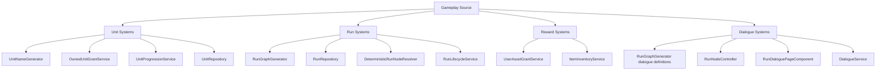

# Active System Structure Index

## Purpose

- Capture how major gameplay systems work in the current implementation.
- Document defaults, fallback behavior, and backend/frontend handoff points.
- Provide exact system-flow references before older planning docs or roadmap notes.

## Scope

- These docs describe implemented behavior as of 2026-07-27.
- These docs do not replace API contracts, data model references, or future roadmap documents.
- When a source file and this documentation disagree, treat the source file as authoritative and update this directory.

## System Documents

1. `01-unit-naming.md`
2. `02-unit-stat-advancement.md`
3. `03-combat-resolution.md`
4. `04-dialogue-flow-determination.md`
5. `05-run-node-generation.md`
6. `06-loot-determination.md`
7. `07-hazard-severity-and-downsides.md`

## Source Map

## Reading Guidance

- For current behavior, start here before reading `documentation/02-systems/mvp-reference/`.
- For schema and persistence details, pair these docs with `documentation/05-technical/04-data-model.md`.
- For player-facing layout and interaction, pair these docs with `documentation/04-ux/`.
