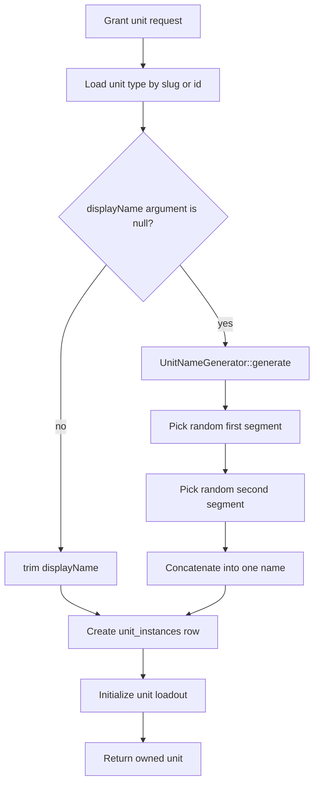
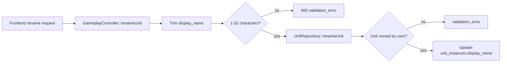

# Unit Naming

## Purpose

Unit naming controls the display name stored on each owned unit instance. Names are assigned when a unit is granted and can later be changed through the rename endpoint.

## Creation Flow

## Name Generation Defaults

`UnitNameGenerator::generate()` builds a name by selecting one random entry from each list and concatenating them without a space or delimiter.

| Field | Default behavior |
| --- | --- |
| First segment | Random value from the `FIRST` list, such as `Ash`, `Bog`, `Iron`, or `Thorn`. |
| Second segment | Random value from the `SECOND` list, such as `back`, `fang`, `tooth`, or `wort`. |
| Random source | PHP `random_int`, so generation is non-deterministic. |
| Example shape | `Ashback`, `Ironfang`, `Thornwort`. |

## Grant Defaults

`OwnedUnitGrantService::grantBySlug()` applies these defaults unless the caller overrides them.

| Value | Default |
| --- | --- |
| `tier` | Parsed from a `_tN` unit-type slug suffix. If no suffix exists, defaults to `1`. |
| `level` | `1` |
| `xp` | `0` |
| `locked` | `false` |
| `displayName` | Generated if the argument is `null`. If a non-null value is passed, it is trimmed and stored. |
| Kin variant | Provided slug if present; otherwise rolled through the backend kin variant service. |

## Rename Flow

## Display Fallback

When units are loaded for a user, `UnitRepository::getUnitsWithEquippedDiceForUser()` maps both `name` and `display_name` from `unit_instances.display_name` when it is not `null`. If the stored display name is `null`, it falls back to the unit type name.

The grant layer only auto-generates when `displayName` is exactly `null`. Callers that want generated names should pass `null`, not a blank string.
