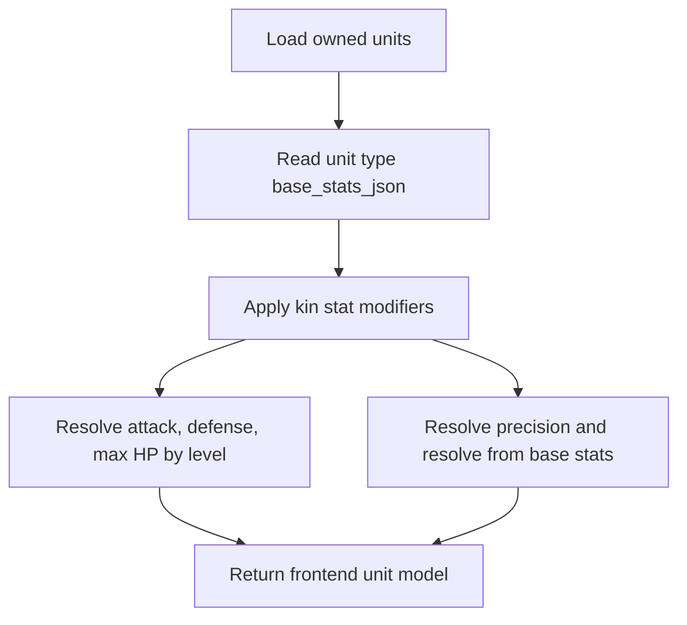
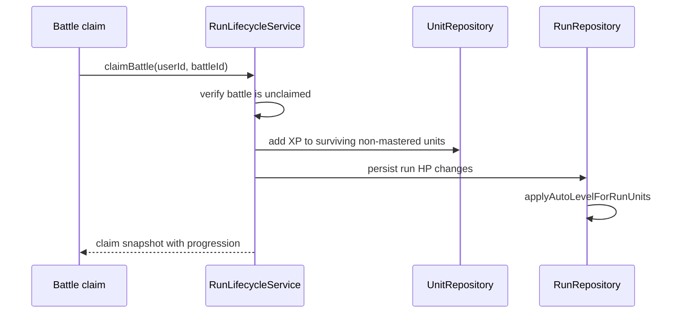

# Unit Stat Advancement

## Purpose

Unit stat advancement determines level-scaled combat stats, XP thresholds, automatic leveling, and run HP persistence.

## Stat Resolution Flow



## Stat Defaults

`UnitProgressionService` accepts decoded arrays or JSON strings. Invalid or missing base stat data resolves to an empty array and then uses defaults.

| Stat | Base default | Minimum | Level scaling |
| --- | ---: | ---: | --- |
| `attack` | `1` | `1` | `base + attack_per_level * max(0, level - 1)` |
| `defense` | `0` | `0` | `base + defense_per_level * max(0, level - 1)` |
| `max_hp` | `1` | `1` | `base + max_hp_per_level * max(0, level - 1)` |
| `precision` | `5` | `0` | Does not scale with level. |
| `resolve` | `5` | `0` | Does not scale with level. |

Per-level values are clamped to `0` or higher before being applied.

## XP and Auto-Level Defaults

```mermaid
flowchart TD
  A[XP added to unit] --> B[RunRepository::applyAutoLevelForRunUnits]
  B --> C{level < max_level?}
  C -- no --> D[Stop]
  C -- yes --> E[Cost = tier * (level + 1) * 50]
  E --> F{xp >= cost?}
  F -- no --> D
  F -- yes --> G[Subtract cost and add one level]
  G --> C
```

| Value | Behavior |
| --- | --- |
| XP cost | `tier * (level + 1) * 50` |
| Level floor | `1` |
| XP floor | `0` |
| Max level floor | `1` |
| Tier floor | `1` |
| XP to next at max level | `0` |

Auto-leveling can consume multiple thresholds in one pass if enough XP has been banked.

## Run Reward Application

Battle claims apply XP through `RunLifecycleService::applyBattleRewardsAndXp()`.



Only combat-like nodes apply XP and run HP changes: `combat`, `boss`, and `chaos`. Defeated units do not receive XP. Units already at max level are skipped.

## HP Model

- In normal unit inventory views, `current_hp` is presented as resolved `max_hp`.
- During active runs, authoritative HP is stored in `run_unit_state`.
- Combat logs are preferred for HP changes. If no detailed HP event data is available, `RunLifecycleService` applies a deterministic fallback HP loss percentage.
