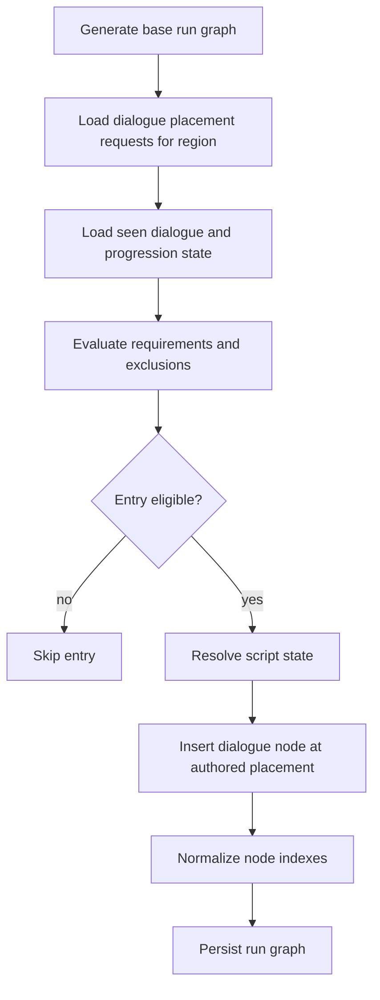
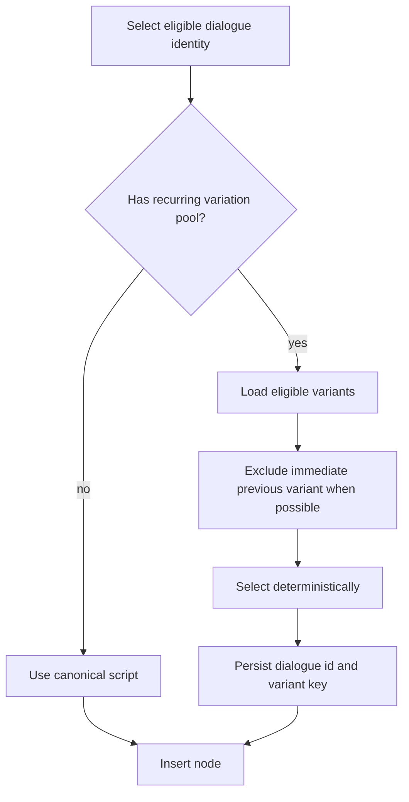
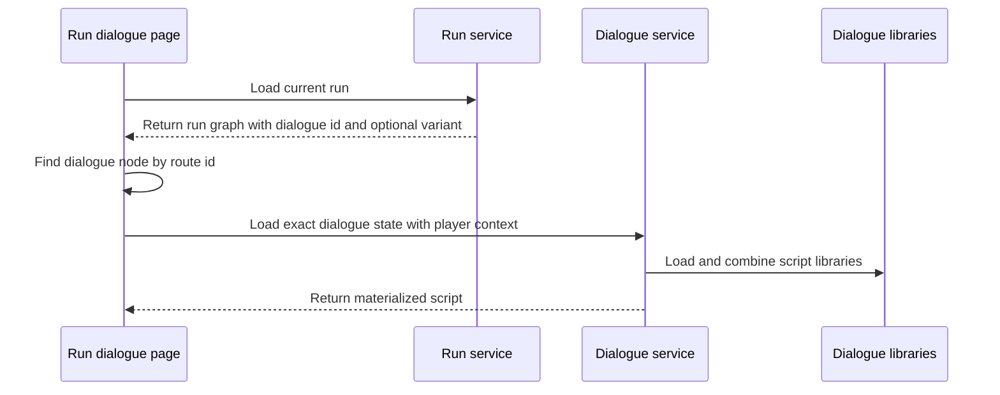
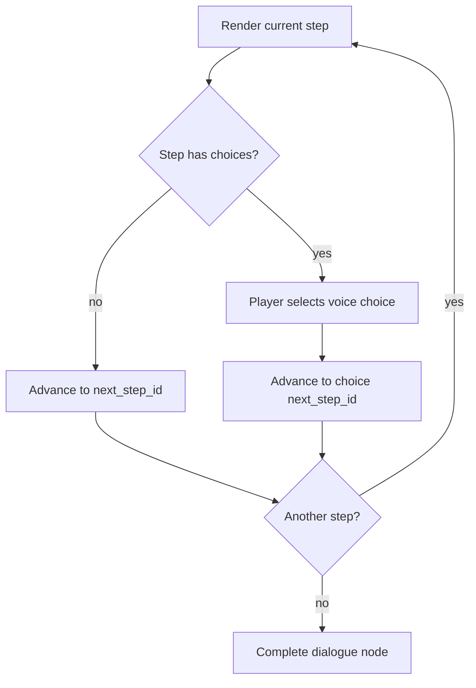
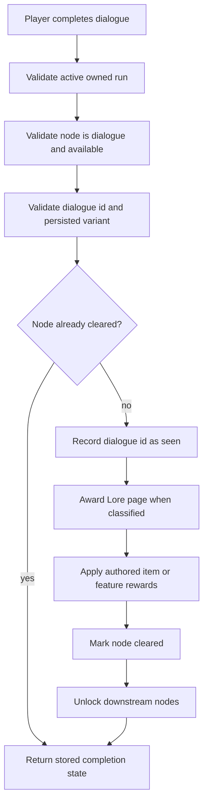

# Dialogue Flow Determination

## Purpose

Dialogue flow determines which authored dialogue entries are inserted into a run, which script and recurring variant are displayed, how player progression affects eligibility, and how completion is recorded.

The canonical script list, participants, narrative purpose, eligibility, repeatability, variant requirements, choices, completion rewards, and Lore classification are defined in the Dialogue and Lore Catalog. This system document owns selection and completion behavior, not dialogue content.

## Run Graph Insertion

A placement request may:

- require a previously completed dialogue
- require a progression or feature unlock
- exclude a progression or feature unlock
- stop appearing after its dialogue id has been seen
- select an initial, unresolved-conflict, or post-progression script state
- target `start`, `before_boss`, `before_exit`, or a random route position
- carry completion rewards

The content catalog defines which current dialogue uses each option.

## Repeatability Resolution

The placement layer uses two kinds of state:

1. **Seen state** records that a dialogue id has been completed.
2. **Progression state** records canonical feature or story conditions used by eligibility rules.

An explicit one-time entry is excluded after its own seen id exists. A recurring entry ignores its own seen id but may still become ineligible because a required or excluded progression condition changes.

Milestone reactions are one-time even when their prerequisite remains true. Acquiring a feature or completing a story milestone may make a reaction eligible, but completing that reaction suppresses it permanently when the catalog marks it one-time.

Dialogue seen state must not be stored as or inferred to be feature ownership. A one-time tutorial or reward dialogue should normally use its own seen id unless it grants a genuine player-facing feature.

## Stateful Script Selection

A single authored placement may select among multiple script states according to content-defined progression and seen-state gates. Typical states include:

- an initial confrontation
- an unresolved-objective repeat
- a post-progression rematch or reaction

State selection must occur before recurring-variant selection. The system does not assign special resolution behavior to a region merely because its dialogue represents a major story milestone.

## Recurring Variant Selection

Recurring dialogue identities contain authored variation pools. The content catalog defines the minimum variant count and required topics for each pool.

Variant selection must:

- use only variants belonging to the selected dialogue identity
- avoid the player's immediately previous variant when another eligible variant exists
- remain deterministic for the persisted run once selected
- preserve the dialogue's participants, narrative state, completion behavior, and Lore classification
- avoid replaying milestone exposition already established by one-time scenes

The selected variant key should be persisted in node metadata or an equivalent run snapshot so reopening the node does not produce different dialogue.

## Script Loading

Run dialogue nodes carry `meta.dialogue_id` and may carry `meta.dialogue_variant_id`. The run dialogue page loads the active run, finds the route node, verifies that it is available, and asks the dialogue service for the exact script state.

Exact-id and persisted-variant selection take precedence over trigger matching for run nodes. Trigger metadata remains useful for organization and non-run dialogue lookup.

## Materialization Defaults

The dialogue service may fill missing presentation data so malformed content can still be diagnosed, but every canonical dialogue must author its final title and summary.

| Field | Fallback |
| --- | --- |
| Title | Humanized script id. |
| Summary | `Recovered dialogue from your journey.` |
| Background URL | `null` |
| Player speaker name | Context player name, then `Player`. |
| Speaker side | Player party or role on left; enemy party on right; otherwise explicit side. |
| Player portrait | Context player portrait URL. |
| Start step | Explicit `start_step_id`, then first step id, then empty string. |
| Player reveal initial delay | At least `200`; default `700`. |
| Player reveal flash count | At least `1`; default `2`. |
| Player reveal flash interval | At least `80`; default `180`. |
| Player reveal between delay | At least `0`; default `220`. |
| Player reveal final hold | At least `300`; default `2000`. |

Use of title or summary fallbacks in current content is implementation drift, not valid authored presentation.

## Choice Traversal

Current player choices are voice choices. They select a short response branch within the current script and reconverge before completion. They do not create persistent relationship values, alternate rewards, combat modifiers, or future eligibility changes.

Any future persistent choice consequence must use a separately authored choice classification and explicit persistence rule rather than changing the meaning of current voice-choice ids.

## Completion

Completion may grant:

- dialogue seen state
- an explicitly classified Lore page
- canonical feature progression
- item stacks

The specific rewards belong to the Dialogue and Lore Catalog and related reward catalogs.

Completion must be idempotent. Retrying the request must not duplicate item grants, Lore pages, or feature unlocks.

## Progression-Gated Dialogue Nodes

A dialogue may represent a major milestone and grant progression without requiring a separate regional completion flow.

The ordinary run graph provides the sequencing:

1. The prerequisite node is cleared.
2. The dialogue node becomes available through its normal incoming edge.
3. Completing the dialogue applies its authored rewards.
4. The dialogue node clears and unlocks its normal downstream nodes.
5. Run progression continues through the standard node and exit rules.

A required `before_exit` dialogue therefore prevents access to the exit by ordinary graph connectivity. It does not require a region-specific completion endpoint, transaction type, or post-boss resolution subsystem.

## Lore Ownership Boundary

Seen dialogue and Lore ownership are separate concepts:

- every completed dialogue needs seen state for progression and idempotency
- only dialogue explicitly classified as Lore creates a Lore Codex page

Generic synchronization must use the canonical Lore allowlist from the Dialogue and Lore Catalog rather than converting all seen dialogue keys.

## Validation Rules

Dialogue flow is aligned when:

- every placed dialogue id and recurring variant has a canonical content definition and loadable script
- every canonical script has an authored title and summary
- effective repeatability matches the content catalog
- stateful dialogue selection respects progression and seen state
- recurring variants avoid immediate repetition when alternatives exist
- selected variants remain stable for the persisted run
- participant and Lore classification are not inferred from storage namespaces
- one-time entries are excluded after completion
- completion rewards are applied once and remain idempotent
- required dialogue nodes gate downstream nodes through ordinary graph connectivity
- no region uses a special dialogue-completion flow unless a separate system requirement explicitly demands one
- downstream nodes unlock only after successful dialogue completion
