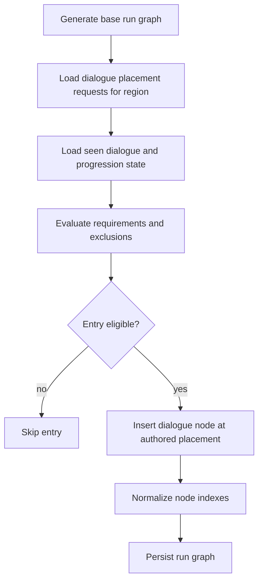
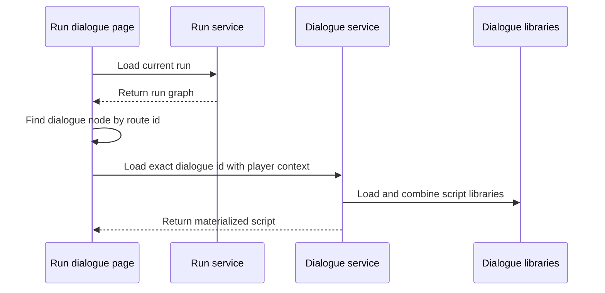
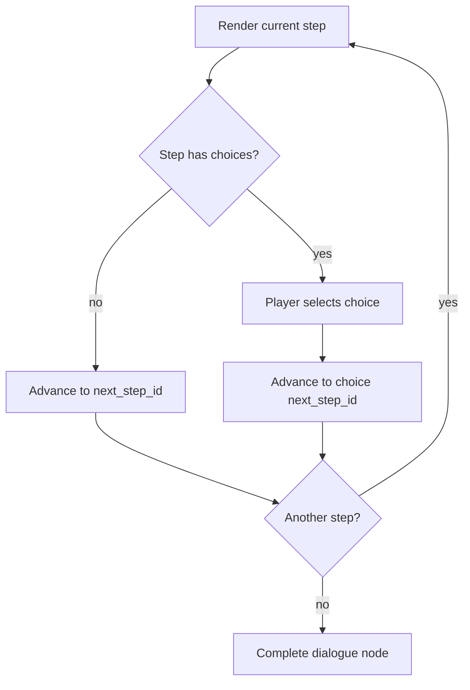
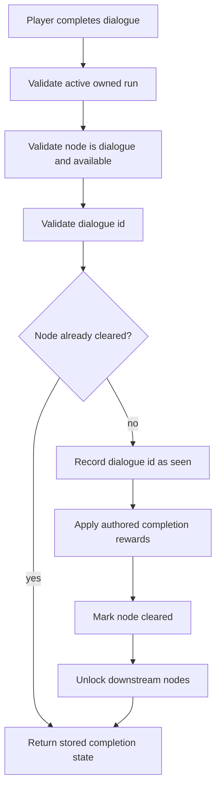

# Dialogue Flow Determination

## Purpose

Dialogue flow determines which authored dialogue entries are inserted into a run, which script is displayed, how player progression affects eligibility, and how completion is recorded.

The canonical script list, participants, narrative purpose, eligibility, effective repeatability, choices, completion rewards, and Lore classification are defined in the Dialogue and Lore Catalog. This system document owns the selection and completion process, not the dialogue content itself.

## Run Graph Insertion

A placement request may:

- require a previously completed dialogue
- require a progression or feature unlock
- exclude a progression or feature unlock
- stop appearing after its dialogue id has been seen
- target `start`, `before_boss`, `before_exit`, or a random route position
- carry completion rewards

The content catalog defines which current dialogue uses each option.

## Repeatability Resolution

The placement layer uses two kinds of state:

1. **Seen state** records that a dialogue id has been completed.
2. **Progression state** records feature, story, or reward conditions used by eligibility rules.

An explicit one-time entry is excluded after its own seen id exists. A recurring entry ignores its own seen id but may still become ineligible because a required or excluded progression condition changes.

This means implementation-level `one_time = false` does not always mean the player can encounter the dialogue repeatedly. A completion reward may change eligibility and create an effective self-disabling one-shot. Effective repeatability is therefore defined in the content catalog rather than inferred solely from one storage flag.

## Script Selection

Run dialogue nodes carry `meta.dialogue_id`. The run dialogue page loads the active run, finds the route node, verifies that it is an available dialogue node, and asks the dialogue service for that exact script id.

Exact-id selection takes precedence over trigger matching for run nodes. Trigger metadata remains useful for script organization and non-run dialogue lookup.

## Materialization Defaults

The dialogue service fills missing presentation data before the component renders the script.

| Field | Default |
| --- | --- |
| Title | Humanized script id. |
| Summary | `Recovered dialogue from your journey.` |
| Background URL | `null` |
| Player speaker name | Context player name, then `Player`. |
| Speaker side | Player party or role on left; enemy party on right; otherwise explicit side. |
| Player portrait | Context player portrait URL. |
| Start step | Explicit `start_step_id`, then first step id, then empty string. |
| Player reveal initial delay | At least `200`; default `700`. |
| Player reveal flash count | At least `1`; default `2`. |
| Player reveal flash interval | At least `80`; default `180`. |
| Player reveal between delay | At least `0`; default `220`. |
| Player reveal final hold | At least `300`; default `2000`. |

Missing authored presentation should be treated as content incompleteness even when these defaults allow the script to render.

## Choice Traversal

Dialogue choices select the next step within the current script. Current choices do not create persistent relationship values, alternate rewards, or future eligibility changes.

Any future persistent choice consequence must be authored as content and supported by an explicit system rule rather than inferred from a branch id.

## Completion

Completion may grant:

- seen-state progression
- feature or progression flags
- item stacks

The current completion-reward package is defined in the Dialogue and Lore Catalog and Loot and Reward Profile Catalog.

## Lore Ownership Boundary

Seen dialogue and Lore ownership are separate concepts:

- every completed dialogue needs seen state for progression and idempotency
- only dialogue explicitly classified as Lore should create a Lore Codex page

Generic synchronization must not turn every seen dialogue key into Lore content. The canonical Lore set is defined by the Dialogue and Lore Catalog.

## Validation Rules

Dialogue flow is aligned when:

- every placed dialogue id has a canonical content entry and a loadable script
- effective repeatability matches the content catalog
- participant and Lore classification are not inferred from storage namespaces
- one-time entries are excluded after completion
- recurring entries remain eligible only while their authored conditions are true
- completion rewards are applied once and remain idempotent
- downstream nodes unlock only after successful dialogue completion
