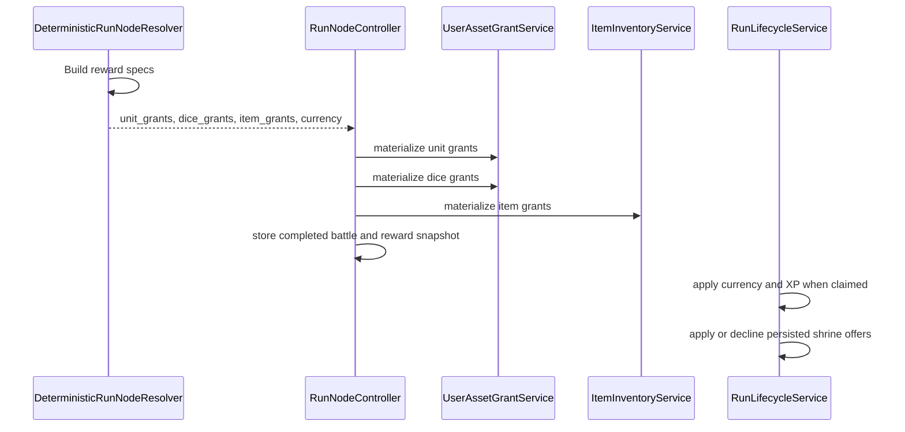
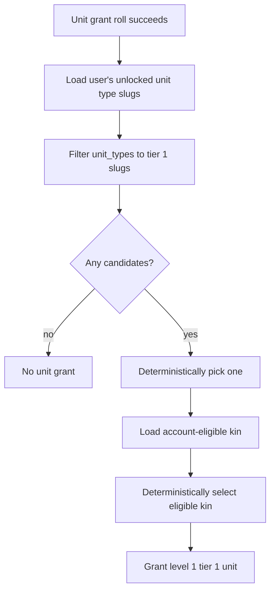

# Loot Determination

## Purpose

Loot determination describes how node rewards are selected, materialized into user-owned assets, and surfaced for claiming.

## Reward Flow

Units, dice, and items are materialized when the node is resolved. Currency and XP are applied when the completed battle is claimed.

Wrong Machine reconstruction is not a normal node-reward roll. It is a separate transactional production flow defined in `09-kin-reconstruction.md`.

## Node Reward Defaults

| Node type | Reward behavior |
| --- | --- |
| `loot` | Starts with `8` soft currency and rolls for units/dice. If neither roll succeeds, a dice grant is guaranteed. |
| `combat` | Rolls for units/dice only on victory; can grant progression items from defeated enemies. |
| `boss` | Rolls for units/dice only on victory; can grant progression items from defeated enemies. |
| `chaos` | Uses combat resolution and battle claim behavior, but current reward rolls are not in the combat/boss/loot grant set. |
| `rest` | No loot grant payload. |
| `hazard` | No loot grant payload. |
| `shrine` | No unit/dice/item grants in the normal loot payload; resolves a generated shrine effect that can grant teeth, heal run units, persist next-combat damage/stat modifiers, double earlier run teeth, upgrade a unit gained earlier in the run, or clear an available combat node. Costly shrines surface accept/decline actions before claim-time effects are applied. |

Declining a declineable shrine stores a normal claim snapshot with zero awarded currency, no XP, and no shrine effects. Repeating the claim returns that stored decision rather than reapplying or changing the offer.

## Shrine Tuning Samples

Use `npm.cmd run sim:shrines:docker` to sample generated shrine effect distribution across Farm, Mountains, and Swamps by quality tier. Region-specific shortcuts are also available:

- `npm.cmd run sim:shrines:farm:docker`
- `npm.cmd run sim:shrines:mountains:docker`
- `npm.cmd run sim:shrines:swamps:docker`

The sampler reports effect counts, primitive counts, primitive mix percentages, average soft-currency output, and declineable-offer counts for each quality tier. Add `--format=json` when calling `backend/bin/sample-shrines.php` directly if raw evidence needs to be saved for tuning notes.

## Unit and Dice Grant Chances

| Node type | Unit grant chance | Dice grant chance | Guarantee |
| --- | ---: | ---: | --- |
| `loot` | `55%` | `80%` | At least one die if no unit or die rolled. |
| `combat` victory | `20%` | `35%` | None. |
| `boss` victory | `20%` | `35%` | None. |

The resolver uses deterministic `nextInt(100)` rolls for each chance.

## Unit Grant Selection

Unit grants only select from unit types already unlocked for the user in the `unit_type` unlock namespace. If no Tier-1 unlocked candidate exists, the grant is skipped.

### Current-phase kin eligibility

| Account state | Eligible kin for ordinary unit grants |
| --- | --- |
| Before first Pig Kin ownership | Basic Goblin only |
| After first Pig Kin ownership | Basic Goblin and Pig Kin |

Pig Kin becomes eligible because the account owns or has owned its first Pig Kin unit. The first Pig Kin is produced by the repeatable Wrong Machine recipe; the recipe does not wait for an ordinary unit drop.

Basic Goblin remains eligible after Pig Kin discovery. It must not be treated as a failed or downgraded Pig Kin result.

Any implementation that rolls globally from every enabled kin or legacy splice definition without consulting account eligibility is implementation drift from the current target contract.

## Reconstruction Unit Selection

The current Pig Kin recipe uses the same deterministic unlocked Tier-1 unit-type candidate pool as ordinary unit grants, but forces the output kin to `pig_kin`.

A successful reconstruction:

- does not consume or replace a normal unit-drop chance
- always creates one unit
- never rolls Basic Goblin as the output kin
- establishes Pig Kin ordinary-drop eligibility only when it creates the player's first Pig Kin

The complete transaction and first-ownership rules are defined in `09-kin-reconstruction.md`.

## Dice Grant Selection

The target dice identity is one active size plus one canonical material. The current legacy implementation may still load `dice_definitions`; implementation reconciliation must follow the Dice Material Catalog and Dice Material Identity model.

A target-state die reward selects:

1. one active size
2. one eligible material that permits that size

Rewards must not create a materialless die or a permanent-affix die.

## Progression Item Grants

Progression items are granted only for victories on `combat` and `boss` nodes.

| Enemy condition | Item grant |
| --- | --- |
| Any enemy slug contains `pig` or `boar`, or equals `mudking` | `pig_ear`, quantity `1` on combat and `2` on boss. |
| Boss node includes enemy slug `mudking` | `mudking_crown_fragment`, quantity `1`. |

Enemy slugs are read from `template_slug`, then `slug`, then `id`.

Pig Kin discovery does not suppress these grants. Pig Ears and Crown Fragments remain repeatable inputs because every Pig Kin reconstruction produces another unit.

## First-Reconstruction Subsidy

The one-time Pig Kin tutorial may grant only the missing Pig Ears and Raw Chaos required to complete one recipe.

- Existing inventory counts first.
- No surplus is granted beyond the recipe requirement.
- The subsidy does not duplicate the Crown Fragment guaranteed by Mudking victory.
- Subsidy application is idempotent.
- The actual reconstruction still consumes the complete recipe.

This subsidy is tutorial progression, not a normal combat, boss, or loot-node reward.

## Materialization Rules

| Grant type | Materialization behavior |
| --- | --- |
| Unit | Malformed grants are ignored. Slug must be unlocked for the user. Tier is clamped to `1-3`; level is at least `1`; XP starts at `0`; generated display name is used. Runtime grant exceptions are skipped. Kin must be valid for the grant source: account-eligible for ordinary grants or recipe-forced for reconstruction. |
| Dice | Malformed grants are ignored. Target-state identity requires one active size and one allowed material. Runtime grant exceptions are skipped. |
| Item | Slug is required and quantity is at least `1`. Items are granted as inventory stacks. Runtime grant exceptions are skipped. |

## Raw Chaos Gate

`RunLifecycleService` zeroes Raw Chaos rewards unless the user has the Wrong Machine feature unlock. This gate is applied at battle claim time.

The first-reconstruction subsidy may grant the missing amount needed for one Pig Kin recipe after the Wrong Machine is unlocked. Later reconstructions require normally owned Raw Chaos.

## Validation Rules

Loot and unit eligibility are aligned when:

- ordinary unit grants use account-eligible kin rather than every enabled kin definition
- Pig Kin cannot appear in ordinary grants before first ownership
- Pig Kin may appear after first ownership
- Basic Goblin remains eligible after Pig Kin discovery
- reconstruction always forces Pig Kin and always creates one unit
- Pig material drops continue after discovery
- retries do not duplicate reward grants, subsidies, or reconstruction results
