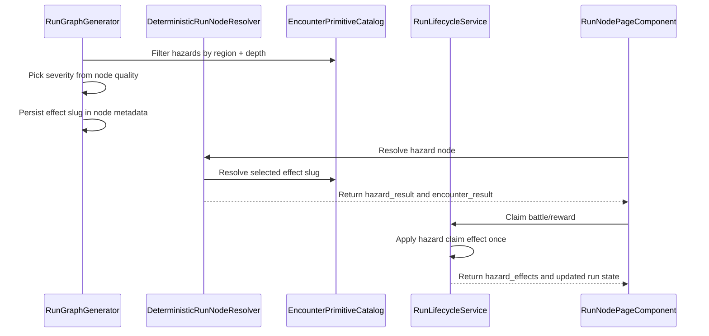

# Hazard Severity And Downsides

## Purpose

This document defines the current hazard behavior and the remaining deferred expansion work.

Hazards are non-combat run nodes that resolve through authored primitive effects. They have no combat XP by default, can apply run pressure at claim time, and surface their result on the run-node page before returning the player to the map.

## Current Contract

- Hazard nodes are generated only when the region/depth has eligible hazard effects.
- Run generation preselects an `encounter_effect_slug`, `encounter_family`, `encounter_severity`, and `encounter_primitive` in node metadata.
- Severity maps from node quality:
  - `poor` -> `minor`
  - `good` -> `moderate`
  - `great` -> `severe`
- The resolver treats `hazard` as a non-combat victory node with `rounds = 0`, `ticks = 0`, and `xp_total = 0`.
- The resolver writes the selected hazard result into battle rewards as `encounter_result`.
- Claiming a hazard applies the effect exactly once through battle claim idempotency.
- Frontend node resolution auto-resolves hazard nodes and shows a hazard effect summary when the result has a recognized effect type.

## Implemented Effect Types

Claim-time hazard effects currently support:

| Effect type | Behavior |
| --- | --- |
| `damage_random_unit` | Damages one living run unit, keeping that unit at 1 or more HP. |
| `damage_squad` | Damages each living run unit, keeping each affected unit at 1 or more HP. |
| `lose_teeth` | Removes up to the requested number of soft currency teeth. |
| `run_stat_modifier_next_combat` | Applies one-combat run stat modifiers to living run units. |
| `stat_modifier_next_combat` | Accepted alias for next-combat stat modifiers. |
| `squad_stat_modifier_next_combat` | Accepted alias for next-combat stat modifiers. |
| `route_pressure` | Records route pressure without an additional state mutation. |

Next-combat stat modifiers can include attack, defense, precision, resolve, and damage modifiers.

## Authored Hazard Catalog

The active hazard catalog lives in `EncounterPrimitiveCatalog`.

Enabled hazard slugs include:

- `hazard_cautious_footing`
- `hazard_mud_slick`
- `hazard_broken_fence`
- `hazard_splintered_trap`
- `hazard_bad_rations`
- `hazard_loose_scree`
- `hazard_thin_air`
- `hazard_toll_cairn`
- `hazard_rust_thicket`
- `hazard_bog_mire`
- `hazard_biting_reeds`
- `hazard_sinking_cache`
- `hazard_wrong_turn`
- `hazard_black_gnats`

`hazard_collapse_warning` exists in the catalog but has zero severe weight and should be treated as disabled until choice handling is implemented.

## Resolution Flow

## Frontend Presentation

`RunNodePageComponent` auto-resolves hazards. It recognizes and summarizes:

- random unit damage
- squad damage
- teeth loss
- next-combat stat modifiers
- route pressure

After claim, the player returns to `/run/map` unless the run has resolved to a terminal summary state.

## Deferred Expansion Notes

The following ideas are not current behavior:

- interactive hazard choices
- item removal or item damage
- Raw Chaos costs
- route locking, route rerouting, or branch clearing from hazards
- explicit Pig Kin mitigation logic beyond authored result metadata
- player choice validation for insufficient costs

These should remain out of weighted generation unless the claim and UI flow supports them.

## Validation Notes

- Hazards should grant no combat XP.
- Claiming or refreshing a resolved hazard should not reroll or reapply the downside.
- Generated maps must not place hazards where no eligible regional hazard effect exists.
- Route-pressure hazards must not make boss or exit reachability depend on an unimplemented mutation.
- UAT should verify visible effect summaries for Farm, Mountains, and Swamps hazards.
