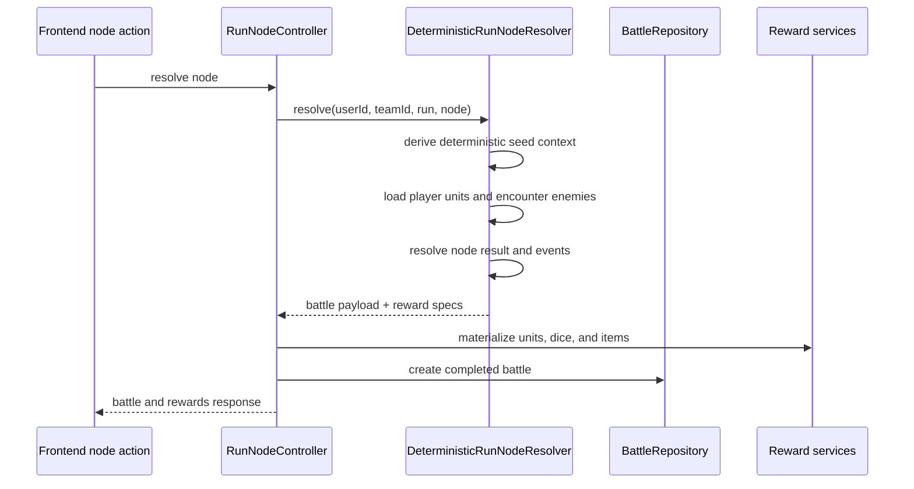
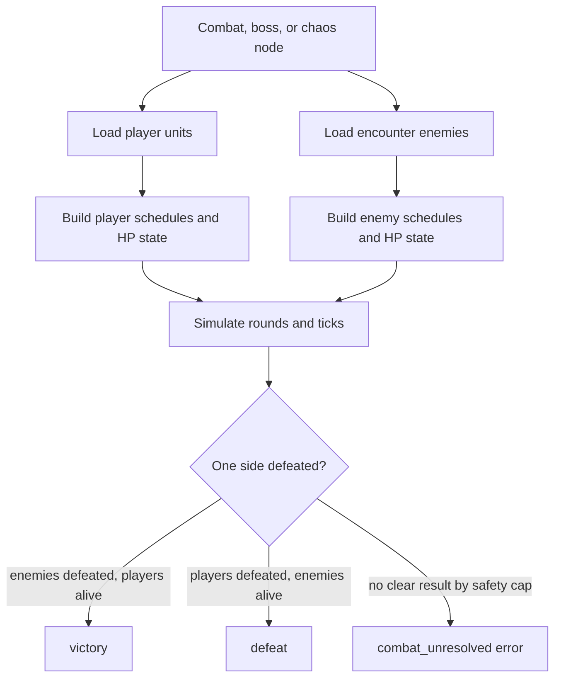
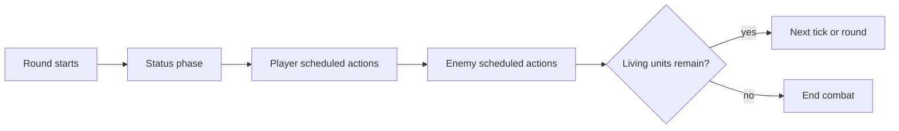

# Combat Resolution

## Purpose

Combat resolution turns a run node into a deterministic battle result, event log, reward payload, and claimable progression package.

## Resolution Flow

## Determinism

The resolver derives its seed context from user, run, run seed, node, team, and encounter-template data. Result metadata includes `seed_key_version` `v2` and engine `deterministic_v1`.

The deterministic resolver depends on current database state for loaded unit stats, equipped abilities, encounter templates, equipped dice, canonical material definitions, unlocked unit types, and enabled kin variants.

Material rerolls, internal rolls, maximum-roll triggers, reward markers, fatal-damage prevention, and revival rolls are part of the deterministic battle result. Reopening a battle or retrying a request must not produce new material outcomes.

## Noncombat Nodes

| Node type | Outcome | Defaults |
| --- | --- | --- |
| `rest` | `victory` | `Full Recovery`, zero XP, zero ticks, zero rounds. |
| `loot` | `victory` | `Loot Cache`, `8` Teeth before reward rolls. |
| `hazard` | `victory` | `Hazard Avoided`, zero XP, zero Teeth. |
| `shrine` | `victory` | Generated shrine effect; may grant Teeth, heal, persist next-combat modifiers, or clear a combat node. |

## Combat Node Math

Combat outcome is determined by simulated combat events. The resolver does not use player-power versus enemy-power scoring as a fallback estimate.

`buildCombatEvents()` simulates rounds, ticks, actions, damage, statuses, and deaths. Enemies dead with players alive is victory; players dead with enemies alive is defeat.

The engine has a safety cap of `200` rounds. Reaching it without a terminal state raises `combat_unresolved`; it does not award a fallback result.

## Run Combat Modifiers

Before combat starts, active run-unit effects can modify combat stats for the next eligible fight. Shrine modifiers currently use this path for damage, attack, defense, precision, and resolve.

- `stat_multipliers` can adjust `attack`, `defense`, `precision`, `resolve`, or combat `damage`.
- `stat_adders` can adjust `attack`, `defense`, `precision`, or `resolve`.
- Applied modifiers appear in participant metadata under `run_combat_modifiers`.
- After a combat-like node resolves, next-combat modifiers are decremented or removed and logged under `run_combat_modifiers_consumed`.

Passive material effects such as Iron, Glass, Lead, Brass, Phoenix Ash, or Living Bone are separate equipped-die effects. They do not consume next-combat run modifiers. Cardboard has no combat effect and contributes only its rolled value.

## Round and Action Timing

- Each round has `20` ticks.
- Combat continues until one side is defeated or the unresolved-combat cap is reached.
- Active abilities are scheduled in equip order by cumulative speed.
- Combatants require at least one schedulable active ability.
- Unused ticks remain empty; the scheduler does not auto-repeat filler actions.

Clockwork Brass may reduce the next delay of its containing ability after a qualifying maximum roll. The selected delay remains part of the persisted deterministic schedule and cannot fall below `1` tick.

## Dice Rolls and Materials

Dice remain bound to ability slots. Each ability rolls the dice provided by its configured slots. Empty slots use the separately defined empty-slot fallback; they are not material dice and cannot trigger material effects.

Every owned die participating in target-state combat has exactly:

- one active size: `d4`, `d6`, `d8`, or `d10`
- one canonical material that permits that size

No current combat die uses `d12` or `d20`.

Cardboard is the neutral material, permits every active size, and applies no special combat behavior. A Cardboard die still has explicit material identity; it is not equivalent to a missing material value.

### Resolution Order

For each action:

1. Roll each participating die's natural face.
2. Resolve material rerolls or internal rolls.
3. Resolve result replacements.
4. Resolve additive die-result bonuses.
5. Combine die results into the ability roll total.
6. Resolve ability scaling and combat stat formulas.
7. Resolve Defense ignoring and final direct-damage modifiers.
8. Apply damage, healing, buffs, debuffs, and other ability outcomes.
9. Resolve after-action material effects.
10. Apply deterministic schedule changes and battle reward markers.

Passive equipped materials are applied when combatant stats and fatal-damage rules are constructed.

### Material Interactions

- Powder Keg and Exploding D4s may each add one non-recursive extra roll to the same qualifying d4 event.
- Chaos Shard internal rolls are one material event and do not independently trigger other maximum-roll effects.
- Sporewood applies `poison`, Moonstone applies `lucky`, and Rusted Iron applies `cracked_armor` using canonical status rules.
- Gold records capped victory-only Teeth markers in the battle result for idempotent claim.
- Phoenix Ash prevention resolves before Living Bone revival when both are equipped, because fatal damage is first reduced to survival before a death-triggered revival is considered.

The Dice Material Catalog owns exact material effects, size eligibility, stacking caps, and valuation.

## XP and Currency Rewards

XP is based on enemy `xp_reward` totals. If enemy XP is empty or zero, the fallback is `10 × difficulty_rating`.

| Outcome | XP | Teeth |
| --- | --- | --- |
| Victory | Full computed XP | `(5 × difficulty_rating) + 0–5`, plus capped material reward markers |
| Defeat | `floor(full XP × 0.25)` | `0` |

XP and Teeth are applied when the battle is claimed, not merely when the node is resolved. Material-generated reward markers are part of the same idempotent claim transaction.

## Validation Rules

Combat resolution is aligned when:

- every participating die has one valid active size and one allowed material
- no affix behavior participates in target-state resolution
- all material random events derive from the battle seed
- material effect order matches the canonical catalog
- passive caps and once-per-action, once-per-round, or once-per-battle limits are enforced
- Gold markers cannot duplicate Teeth across claim retries
- fatal-damage prevention and revival use a stable order
- Cardboard applies no special combat effect
- no `d12` or `d20` die enters current combat