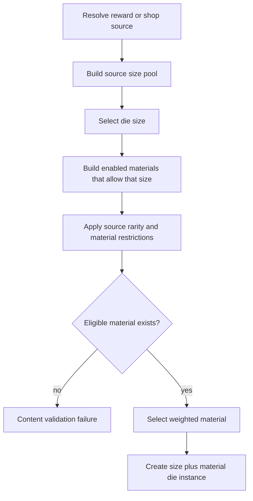

# Dice Material Identity and Generation

## Purpose

Define the canonical target model for permanent dice identity, rarity, material eligibility, generation, effect resolution, stacking, valuation, and migration from the legacy affix model.

This document owns system rules. The concrete material roster, effect values, drop weights, display copy, art, and material-specific size lists belong in the Dice Material Catalog. Storage tables, migrations, APIs, and behavior-handler implementation belong in technical documentation and code.

## Target-State Boundary

The target model is:

```text
Die identity = die size + material
```

A material is not a cosmetic label layered over an independent rarity. The material defines:

- the die's rarity
- the die's permanent special behavior
- the die sizes on which that material may appear
- the material contribution to value and salvage
- the player-facing identity of the die

The target model does not contain permanent instance affixes, affix slots, or an independent die-rarity roll.

Existing implementation data may still contain independent rarity fields, affix definitions, affix-capacity rules, and per-instance affix rows. Those records are legacy migration inputs until implementation is reconciled with this document. They are not competing target-state content.

This change does not alter the ability-slot binding model. Dice remain equipped to ability slots, and empty ability slots continue to use the separately defined fallback behavior. Material effects modify the behavior of an equipped die when that die participates in resolution.

## Active Die Sizes

The current active inventory sizes are:

- `d4`
- `d6`
- `d8`
- `d10`

`d12`, `d20`, and other sizes remain future content until they are explicitly enabled by the dice system and supported by material eligibility.

A future size does not become available merely because a material could theoretically support it.

## Permanent Die Identity

A mechanically complete owned die contains:

- one active die size
- one enabled material that permits that size
- ownership and equipment state

Two dice with the same size and material are mechanically identical. Instance identity exists for inventory ownership, equipment, sale, salvage, and audit purposes; it must not introduce hidden rolls, quality values, or undeclared bonuses.

Every die must have a material. A null, missing, or implicit material is invalid target-state data.

Cardboard is the explicit neutral baseline material. It is Common, supports every active size (`d4`, `d6`, `d8`, and `d10`), and has no special effect. Ordinary dice use Cardboard rather than a null or inferred material value.

### Display Identity

The default player-facing name should be material-led, such as:

```text
Cardboard d6
Peach Pit d4
Glass d10
```

Rarity is displayed from the material definition. It is not separately selected or independently editable on the die instance.

## Material Definition Contract

Every enabled material must define the following authored properties:

| Property | Requirement |
| --- | --- |
| Stable key | Unique durable identifier used by content, persistence, and behavior lookup. |
| Display name | Player-facing material name. |
| Rarity | Exactly one supported rarity tier. |
| Allowed sizes | Explicit non-empty allowlist of active die sizes. |
| Effect summary | Short player-facing explanation of the material's permanent behavior. |
| Effect trigger | The event or state that causes the effect to resolve. |
| Effect parameters | Authored values required by the behavior. |
| Stacking rule | Explicit behavior when multiple copies or repeated triggers apply. |
| Value modifier | Contribution to shop value relative to the die's base size value. |
| Salvage modifier | Contribution to Raw Chaos salvage, when distinct from shop value. |
| Tags | Design and filtering vocabulary such as healing, defensive, volatile, economy, or status. |
| Enabled state | Whether the material is eligible for generation and normal ownership. |

A material may define a benefit, a drawback, or a paired benefit and drawback. The complete effect package is the material's identity; there is no secondary permanent affix layer.

## Rarity Model

The supported rarity vocabulary remains:

- Common
- Uncommon
- Rare
- Epic
- Legendary

Rarity is a property of the material.

### Rarity Controls

Rarity may control or influence:

- generation frequency
- reward-source eligibility
- shop availability
- presentation treatment
- default valuation band
- expected complexity or specialization

Rarity does not guarantee that every higher-rarity material is a strict numerical upgrade over every lower-rarity material. Rare materials may be narrower, riskier, more build-dependent, or more unusual rather than universally stronger.

### Invalid Independent Rarity

The following target-state combinations are invalid:

- a die instance whose rarity differs from its material rarity
- the same material appearing at multiple rarity tiers without separate authored material keys
- rarity determining affix capacity
- rarity adding unnamed hidden effects

If implementation continues to retain a rarity column for compatibility, its value must be derived from the material and must not independently affect generation or resolution.

## Material Size Eligibility

Every material owns an explicit allowlist of die sizes.

A material-size pair is valid only when:

1. the size is active
2. the material is enabled
3. the material's allowed-size list contains the size

There is no implicit "all sizes" default. Supporting every active size must be an explicit content decision. Cardboard deliberately supports every active size because it is the neutral baseline material.

### Size-Breadth Guidance

The following are design guidelines rather than hard validation limits:

| Rarity | Typical active-size breadth |
| --- | ---: |
| Common | 2–4 sizes |
| Uncommon | 2–3 sizes |
| Rare | 1–3 sizes |
| Epic | 1–2 sizes |
| Legendary | 1 size, occasionally 2 |

Narrow size access is a balancing tool. It may be used to:

- limit how frequently an effect triggers
- prevent a scaling effect from appearing on inappropriate faces
- preserve a material's silhouette and strategic identity
- reserve dramatic effects for specific roll ranges
- create meaningful collection targets

A one-size material should feel deliberately unique. It should not be used to compensate for an effect that has not been balanced across multiple sizes.

### Size-Family Heuristics

For the current active sizes:

- `d4` and `d6` favor frequent triggers, small recovery, stacking utility, and effects that benefit from consistency
- `d8` and `d10` favor larger swings, stronger thresholds, burst outcomes, and risk-reward effects

Materials may cross these families when their behavior remains coherent at every allowed size.

### Coverage Requirements

The material catalog must maintain the following coverage:

- every active die size has at least one enabled Common material
- every enabled material supports at least one active size
- every generation source has at least one eligible material for every size it can select
- every material effect is reviewed at the minimum and maximum size in its allowlist
- Cardboard remains eligible on every active size unless the baseline-material decision is deliberately replaced

Changing a material's allowed-size list is a content change. Removing a size requires a migration decision for owned dice already using that pair.

## Normal Random Generation

Normal random die generation is size-first.



### Generation Steps

1. The acquisition source defines its eligible size pool and size weights.
2. The generator selects one active size.
3. The generator builds a material pool containing only enabled materials that explicitly allow that size.
4. Source-specific rarity bands, unlock requirements, region restrictions, guarantees, or exclusions refine the material pool.
5. The generator selects one material using the applicable weights.
6. The resulting size-material pair is persisted as the die's complete permanent identity.

Size-first selection keeps the size economy independently tunable. A narrowly available material must not accidentally make its supported size more common, and a broad material must not distort the intended size distribution.

### Authored Material Guarantees

A reward may explicitly guarantee a material. In that case, the source must select or specify a size from that material's allowed-size list.

An authored reward must never bypass size eligibility. If its requested pair is invalid, content validation must fail rather than silently substituting a different material or size.

### Empty Pools

An empty eligible-material pool is a content error. Runtime generation must not:

- create a materialless die
- attach a material that does not allow the selected size
- silently fall back to legacy rarity-only dice
- silently add an affix
- silently substitute Cardboard unless the source explicitly allows baseline fallback

Content validation should detect empty pools before release.

## Material Effect Resolution

A material effect is part of die resolution, not an inventory-only label.

Every effect must declare one primary trigger classification, such as:

- passive while equipped
- when the die is rolled
- after the roll value is known
- when the die rolls its minimum
- when the die rolls its maximum
- when the containing ability resolves
- when the containing ability damages, heals, guards, or applies a status

The behavior may read authored context such as:

- rolled value
- die size
- ability role or effect type
- acting unit
- selected target
- current health or guard
- combat statuses
- whether the roll met a threshold

Unless explicitly defined as passive, a material effect resolves only when its die participates in an ability roll. Merely owning or equipping the die does not activate it.

A die triggers its material effect at most once for one roll event unless the material explicitly defines multiple sub-events. Reopening a combat result or retrying an idempotent request must not trigger the effect again.

Cardboard defines no material effect and therefore adds no trigger beyond the normal die roll.

## Stacking and Duplicate Materials

Duplicate size-material dice are allowed unless a future material explicitly receives a uniqueness rule.

The default stacking behavior is independent resolution per participating die. For example, two eligible material dice rolled by one ability may each trigger their own effect.

Any effect that creates persistent combat state must specify:

- whether stacks are additive, replacing, maximum-only, or non-stacking
- maximum stacks, when capped
- duration
- refresh behavior
- whether multiple units share or isolate the state

Percentage modifiers, multipliers, repeated healing, repeated damage, and resource generation must not rely on an unstated global stacking convention.

Material combinations do not create implicit set bonuses. A future set or synergy system must be authored separately.

## Material Design Constraints

A material is ready for the catalog when it satisfies all of the following:

- its effect can be understood from a short tooltip
- its mechanical impact is noticeable during normal play
- its allowed sizes are deliberate and defensible
- its stacking behavior is explicit
- its effect remains coherent at every allowed size
- its role is distinguishable from existing materials
- it has at least one plausible build or tactical use
- it does not depend on a hidden affix or undeclared instance roll
- any drawback is visible to the player

Cardboard is the deliberate exception to the noticeable-effect guideline because its authored purpose is to provide the explicit neutral baseline. Neutrality must not be represented by missing data.

Minor numerical bonuses may be used, but a material should not exist solely to provide an imperceptible percentage difference. Materials are the primary source of permanent die variety.

## Interaction with Other Systems

### Ability Slots

Dice remain bound to authored ability slots. The material effect follows the die instance and resolves when that slot uses the die.

### Global Features

A feature may modify classes of dice, such as a rule affecting eligible `d4` dice. Global features are progression rules, not permanent affixes. They may coexist with material behavior when their interaction order is explicitly defined.

### Temporary Run Effects

Shrines, hazards, statuses, or run modifiers may temporarily change die behavior. Temporary effects do not become permanent materials or affixes and disappear according to their own lifecycle.

### Shop and Rewards

Reward and shop sources may control:

- size weights
- material rarity bands
- individual material weights
- guaranteed material-size pairs
- unlock or region eligibility

They must not create invalid material-size combinations.

### Codex

The Dice Material Catalog is the key source for material Codex pages. Owning a die with a material may discover that material's page. Permanent affix Codex pages are not part of the target model.

## Valuation

Permanent die value is based only on size and material.

The target valuation shape is:

```text
value = round(base size value × material value modifier)
```

The material modifier subsumes the legacy independent rarity bonus and affix premiums.

A rarity tier may define a default modifier band, but the material catalog owns the final authored modifier. A risky or highly specialized material may be valued differently from another material of the same rarity.

Raw Chaos salvage likewise derives from size and material. The exact salvage formula may differ from shop value, but it must not depend on removed affix slots or affix rarity.

Cardboard uses the neutral `1.00x` value and salvage modifiers.

## Material Mutability

Materials are fixed when a die is normally generated.

A future Wrong Machine recipe or crafting system may replace a die's material, but replacement must:

- select an enabled material
- validate the existing die size against the new material's allowed sizes
- preserve or intentionally replace the die instance according to the crafting contract
- never leave a partially migrated hybrid die

This document does not authorize rerolling, adding secondary materials, or restoring permanent affixes.

## Legacy Affix Retirement

Permanent affixes are not part of the target model.

Each existing affix or affix-like effect must be reviewed and assigned one disposition:

1. **Convert to a material** when the effect can define the identity of an entire die.
2. **Merge into a material** when the effect is too narrow or weak to stand alone.
3. **Move to another system** when the behavior is better represented by an ability, feature, shrine, hazard, status, or temporary run effect.
4. **Remove** when the behavior is redundant, unclear, or incompatible with the new model.

The conversion process must not create materials automatically from every legacy affix. Material quality is determined by the material design constraints, not by preservation of old data volume.

## Owned-Die Migration Requirements

The eventual implementation migration must convert every owned die into one valid size-material pair.

Migration must preserve where possible:

- die size
- owner
- equipped unit and ability slot
- inventory identity needed for audit or client references

Migration must define deterministic handling for:

- rarity-only dice
- dice with one affix
- dice with multiple affixes
- invalid or disabled affix combinations
- legacy sizes not enabled by the target model
- a converted material that does not support the die's current size

The migration must not retain hybrid dice containing both a material effect and permanent affixes.

Starter and explicitly neutral legacy dice migrate to Cardboard while preserving their active size. The exact conversion table for other dice remains a separate implementation and content decision. Existing affix rows remain evidence for that decision, not target-state content.

## Resolved Material-Catalog Decisions

The Dice Material Catalog defines:

- the initial 32-material roster
- each material's stable key, rarity, effect, allowed sizes, tags, and valuation
- standard generation weights by rarity
- exact effect-handler requirements
- per-size coverage
- legacy affix-to-material mappings
- Cardboard as the starter and neutral baseline material
- material Codex keys and discovery identity
- no unique or quantity-limited materials in the initial roster
- no current support for `d12`, `d20`, or other sizes

## Validation Rules

The target dice model is aligned when:

- every owned die has exactly one active size and one enabled material
- the material explicitly permits the die size
- die rarity is derived from material
- no permanent affix slots or affix effects participate in generation or resolution
- two dice with the same size and material have identical mechanical behavior
- normal random generation selects size before material
- authored guarantees still validate material-size compatibility
- generation pools cannot become empty for a selectable size
- every material defines effect, rarity, allowed sizes, stacking, and valuation
- Cardboard supports every active size and has no special effect
- material effects resolve idempotently with their declared trigger
- shop value and salvage do not depend on legacy affix premiums
- migration produces no hybrid material-plus-affix dice