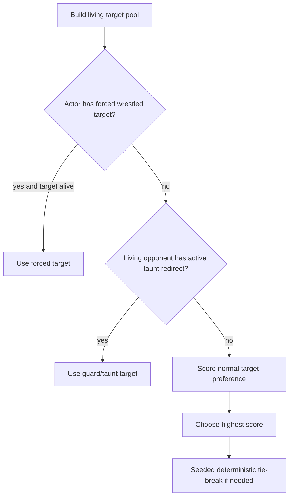

# Target Resolution

## Purpose

Target resolution determines which living combatant receives an active ability when combat is resolved automatically on the server.

Players do not select targets during combat. Each active ability carries an authored target preference, and the deterministic combat engine resolves that preference against current formation, health, statuses, and prior targeting state.

## Target Pool

Target resolution begins by deciding which side the ability may target.

- `self` targets the acting unit.
- target preferences beginning with `ally_` are support targets.
- all other current target preferences are hostile targets.

For a player action:

- support abilities select from living player units
- hostile abilities select from living enemies

For an enemy action:

- support abilities select from living enemies
- hostile abilities select from living player units

Defeated units are not valid targets.

If only one valid target remains, that target is selected without further weighting.

## Resolution Precedence

Hostile target resolution has override rules that run before the ability's normal preference scoring.

### Wrestled / forced-next-attack

A `wrestled` status can store the source unit as the actor's forced target. If that unit is still alive, the actor's next hostile action is restricted to that target and the normal preference is bypassed.

### Guard / taunt redirect

A living target with `guard_stacks` configured for `taunt_redirect` can redirect hostile attacks to itself. When multiple eligible redirectors exist, the most recently applied qualifying guard state wins.

Support abilities do not use hostile guard redirection.

## Authored Target Preferences

The current ability target vocabulary is:

| Preference | Current behavior |
| --- | --- |
| `self` | Select the actor. |
| `ally_front_prefer` | Prefer living allies whose occupied formation reaches furthest toward the front. |
| `ally_back_prefer` | Prefer living allies whose occupied formation reaches furthest toward the back. |
| `ally_lowest_hp_pct` | Select the living ally with the lowest current-HP percentage. |
| `ally_highest_attack` | Declared target type; see Known Runtime Drift. |
| `ally_random` | No preference score; seeded deterministic tie-break among living allies. |
| `enemy_front_prefer` | Prefer living enemies furthest toward the front. |
| `enemy_back_prefer` | Prefer living enemies furthest toward the back. |
| `enemy_lowest_hp` | Prefer the living enemy with the lowest absolute current HP. |
| `enemy_highest_threat` | Prefer the living enemy with the highest `attack + defense`. |
| `enemy_wounded_prefer` | Prefer enemies at or below 30% maximum HP. |
| `enemy_marked_prefer` | Prefer enemies carrying `marked`. |
| `enemy_debuffed_prefer` | Prefer enemies carrying one or more debuff types, with additional weight for more debuffs. |
| `enemy_most_debuffed` | Stronger weighting toward enemies carrying more distinct debuff types. |
| `enemy_preferred_previous_target` | Prefer the actor's previous hostile target when it remains valid. |
| `enemy_random` | No preference score; seeded deterministic tie-break among living enemies. |

Some runtime target strings combine multiple preference terms. The selector intentionally recognizes those terms compositionally rather than requiring every combined string to appear as a separate enum case.

## Preference Scoring

Except for direct cases such as `self` and `ally_lowest_hp_pct`, valid targets receive scores from the active preference terms.

| Preference condition | Score |
| --- | ---: |
| Frontmost candidate | `+300` |
| Backmost candidate | `+300` |
| Lowest absolute HP | `+275` |
| Highest threat (`attack + defense`) | `+275` |
| Wounded (HP <= 30% max HP) | `+250` |
| Marked | `+260` |
| Debuffed | `+220` plus `10` per debuff type |
| Most-debuffed weighting | `+200` plus `25` per debuff type |
| Previous preferred target | `+290` |

Scores can stack when a target string expresses multiple preferences.

Example: Aimed Shot can be modified by progression passives to use a combined preference for backline, marked, wounded, and the actor's previous target. A candidate satisfying several of those properties accumulates the corresponding scores.

## Formation Inputs

Front and back targeting use the unit's complete occupied footprint, not only a single visual anchor cell.

The combat position profile records:

- `front_x` — greatest occupied horizontal coordinate
- `back_x` — smallest occupied horizontal coordinate
- `top_y`
- `bottom_y`

A large unit can therefore qualify for front- or back-related rules based on any cells occupied by its footprint.

See `warband-and-formation.md` for formation geometry and orientation.

## Debuff Counting

Targeting that considers debuffs counts distinct debuff types on the candidate.

Statuses explicitly marked `is_debuff` count as debuffs. The combat engine also treats statuses as debuffs by default unless they belong to its known non-debuff set.

Some status parameters can make one status count as additional debuff types for targeting and related combat effects.

## Deterministic Tie-Breaking

After scoring, the engine finds every candidate tied for the highest score.

If more than one candidate remains, it uses the battle's seeded deterministic random state to select among them. This gives `*_random` preferences random-looking results while keeping combat replayable and idempotent.

A request retry or reopened battle result must not independently reroll the target choice.

## Previous-Target Preference

The resolver tracks the actor's prior hostile target during the battle.

Abilities using a previous-target preference can receive a large score bonus for staying on that target while it remains alive and otherwise valid. This produces target persistence without making the previous target an absolute forced target.

Forced statuses and taunt redirection still take precedence.

## Multi-Target Abilities

An ability whose authored parameters specify `target_count > 1` resolves a primary target first.

Additional targets are then selected one at a time:

- the primary target is excluded
- previously selected extra targets are excluded
- the same target preference is applied to the remaining living candidates
- each additional selection uses the deterministic combat RNG for ties

Additional outcomes are logged separately as splash actions.

## Battle-Log Transparency

Normal action events record:

- the selected target id
- `targeting_reason`
- `targeting_weights`

`targeting_weights` includes each considered target's numeric score and the reasons contributing to it. This is the primary debugging surface for explaining why a server-resolved action chose a particular target.

## Known Runtime Drift

### `ally_highest_attack`

`AbilityTarget` currently declares `ally_highest_attack`, and authored abilities may reference it. The current selector does not implement a distinct highest-attack scoring branch.

As implemented, that target string receives no highest-attack bonus; absent another recognized term, living allies tie at score `0` and selection falls through to the seeded deterministic tie-break.

This is an implementation gap, not the intended semantic meaning of the target name. Do not document or test it as "highest attack wins" until the selector implements that behavior.

## Related Documents

- `combat-resolution.md` — deterministic battle lifecycle, action timing, and outcome resolution
- `ability-loadouts-and-dice-binding.md` — where active ability target preferences enter the equipped schedule
- `warband-and-formation.md` — front/back geometry and combat position
- `documentation/03-content/05-enemy-abilities.md` — authored enemy ability content
