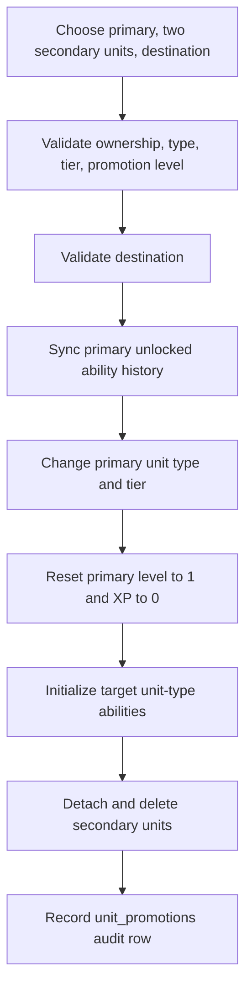

# Unit Promotion

## Purpose

Unit promotion converts three eligible copies of one unit type into one higher-tier unit while preserving the primary unit's identity and accumulated progression history.

This document defines the current runtime contract. Older promotion evaluations under `mvp-reference/` are design history and do not override these rules.

## Eligibility

A promotion uses exactly three owned units:

- one primary unit that survives the promotion
- exactly two secondary units that are consumed

All three units must:

- belong to the same player
- have the same exact `unit_type_id`
- have the same tier
- have reached or exceeded that unit type's authored `promotion_level`

`promotion_level` is the runtime threshold. Promotion does not inherently require the unit to be at its authored `max_level`.

A unit is not promotion-eligible when its unit type has no promotion level or when no valid promotion destination exists.

## Active-Run Restriction

The primary and both secondary units must be mutable outside an active run snapshot.

The backend rejects promotion when:

- the primary unit is locked into an active run
- either secondary unit is locked into an active run

Secondary units in an active run cannot be consumed even when the primary unit is otherwise eligible.

## Promotion Destinations

Promotion destinations are derived from authored unit-type families and the player's available progression paths.

Unit-type slugs use a family-and-tier convention such as:

```text
bruiser_t1
bruiser_t2
bruiser_t3
```

The family is the slug without its `_tN` suffix.

### Chain Promotion

A destination is `chain` when it advances the current family to its next authored tier.

Example:

```text
bruiser_t1 -> bruiser_t2
```

### Sideways Promotion

A destination is `sideways` when promotion advances the unit into another eligible family at the next promotion tier.

Sideways eligibility is based on families available through the unit's accumulated progression history and unit-type families unlocked for the player. The runtime does not allow an arbitrary jump into every authored family.

Promotion options are returned with chain destinations first, followed by sideways destinations ordered by branch name.

If a promotion request does not specify a destination, the backend selects the chain destination when one exists. If there is no chain destination, it selects the first valid option.

## Promotion Transaction

Promotion is an atomic mutation.



The primary unit keeps its instance id and display name. It becomes the promoted result rather than being replaced by a newly created unit instance.

The two secondary units are removed from their ability-dice bindings, squad membership, formation cells, and run-unit state before their unit instances are deleted.

## Ability Inheritance

Promotion is cumulative for ability access.

Before the primary changes type, its currently authored abilities are synchronized into its instance-level unlocked ability catalog. After the type changes, the target type's authored abilities are added to that catalog.

This means a promoted unit can retain ability access from prior unit-type stages while gaining abilities from its new stage.

The existing equipped active-ability loadout is not replaced merely because the unit was promoted. Target-type abilities become available to the unit, but the player can decide whether to put newly unlocked active abilities into the combat loadout.

Inherited passive abilities from prior stages are surfaced separately from the current type's authored ability package and continue to participate in the unit's progression identity.

See `ability-loadouts-and-dice-binding.md` for the distinction between unlocked abilities, equipped active abilities, passives, and dice-slot bindings.

## Capstones

Capstones and promotion are related but separate progression decisions.

The current runtime exposes the primary unit's capstone state in promotion preview data:

- `none`
- `unearned`
- `ready_to_select`
- `selected`

Promotion does **not** currently require a ready capstone to be selected first. A unit that has reached its promotion level may therefore promote while its current-type capstone remains unselected.

The promotion preview reports this condition through `will_skip_current_capstone` so the client can warn the player before committing the promotion.

## Result

A successful promotion produces:

- the same primary unit instance id
- the selected destination unit type
- the destination tier
- level `1`
- XP `0`
- two consumed secondary unit ids
- persisted promotion history
- accumulated unlocked ability history

## Failure Conditions

Promotion fails when any required invariant is not met, including:

- fewer or more than two secondary units
- duplicate secondary ids
- primary path id does not match the request primary
- any unit is not owned by the player
- the three units do not share exact type and tier
- any unit is below its authored promotion level
- the requested destination is not currently valid
- any participating unit is locked into an active run

## Known Design Considerations

### Promotion level versus mastery

Legacy planning material often described promotion as consuming three max-level units. Current implementation instead uses the authored `promotion_level`, which can differ from `max_level`. Any design decision to require mastery before promotion must be implemented explicitly rather than inferred from older documents.

### Capstone skipping

The backend deliberately exposes capstone-skip warning state but does not block the promotion. If capstone selection is intended to become mandatory before leaving a type, that is a future behavior change.

## Related Documents

- `unit-stat-advancement.md` — levels, XP, and stat progression
- `ability-loadouts-and-dice-binding.md` — persistent ability access and equipped loadouts
- `warband-and-formation.md` — squad/formation effects of consuming secondary units
- `documentation/04-ux/02-warband-management.md` — player-facing promotion management
- `mvp-reference/10-promotion-structure-evaluation.md` — historical design evaluation only
