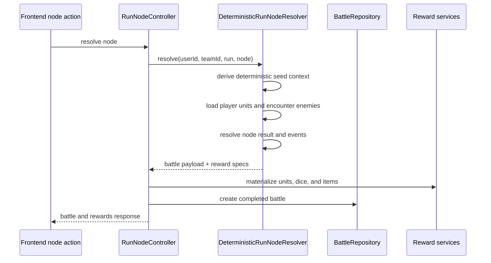
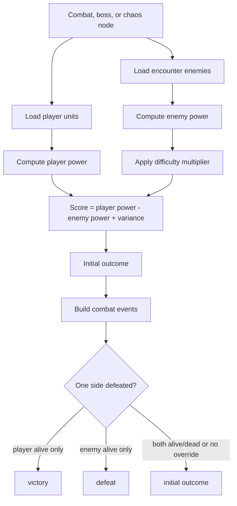
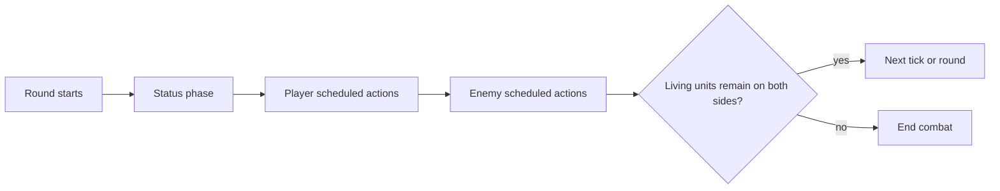

# Combat Resolution
----

Status: active
Last Updated: 2026-07-27
Owner: Engineering
Depends On: `backend/src/Combat/Engine/DeterministicRunNodeResolver.php`, `backend/src/Controllers/RunNodeController.php`, `backend/src/Services/RunLifecycleService.php`

## Purpose

Combat resolution turns a run node into a deterministic battle result, event log, reward payload, and claimable progression package.

## Resolution Flow



## Determinism

The resolver derives its seed context from user, run, run seed, node, team, and encounter template data. Result metadata includes `seed_key_version` `v2` and engine `deterministic_v1`.

The deterministic resolver still depends on current database state for loaded unit stats, equipped abilities, encounter templates, dice definitions, unlocked unit types, and enabled kin variants.

## Noncombat Nodes

The resolver handles these node types without round simulation.

| Node type | Outcome | Defaults |
| --- | --- | --- |
| `rest` | `victory` | `Full Recovery`, zero XP, zero ticks, zero rounds. |
| `loot` | `victory` | `Loot Cache`, `8` soft currency before reward rolls. |
| `hazard` | `victory` | `Hazard Avoided`, zero XP, zero currency. |
| `shrine` | `victory` | Random favor from `bone_whisper`, `rust_blessing`, or `bog_luck`; `4-8` soft currency. |

## Combat Node Math

The `score` is not a player-facing score, rating, or reward value. It is an internal fallback decision used to choose an initial win/loss result before the detailed combat event simulation is checked.



Power uses:

```text
attack * 1.4 + defense * 1.1 + max_hp * 0.35 + ability_count * 1.25
```

Enemy power is multiplied by:

```text
1.0 + ((difficulty_rating - 1) * 0.07)
```

The initial outcome variance is a deterministic roll from `-10` through `10`, multiplied by `0.4`.

That means the score can move by at most `-4.0` to `+4.0` from variance.

Example:

```text
player_power = 42
enemy_power = 39
variance = -5

score = (42 - 39) + (-5 * 0.4)
score = 3 - 2
score = 1
initial outcome = victory
```

If the score is `0` or higher, the initial outcome is `victory`. If it is below `0`, the initial outcome is `defeat`.

After that, `buildCombatEvents()` simulates rounds, ticks, actions, damage, statuses, and deaths. If that simulation ends with enemies dead and players alive, the outcome becomes `victory`. If it ends with players dead and enemies alive, the outcome becomes `defeat`. If the simulation does not clearly prove either side won, the resolver keeps the score-based initial outcome.

## Round and Action Timing

- Each round has `20` ticks.
- Planned combat length is `3-5` rounds before event simulation can end it sooner.
- Active abilities are scheduled in equip order by cumulative speed.
- If no active ability can be scheduled, the unit receives a fallback `basic_attack_melee` at tick `4`.
- Repeatable filler abilities can fill remaining ticks when they fit inside the 20-tick round.



## Dice Rolls

Each ability rolls its provided dice pool. Empty pools produce a zero modifier. For each die, the roll total contributes:

```text
roll_total - ceil(sides / 2)
```

Dice with the `explode_once` affix roll one extra die when the first roll equals the die's side count.

## XP and Currency Rewards

XP is based on enemy `xp_reward` totals. If enemy XP totals are empty or zero, the fallback is `10 * difficulty_rating`.

| Outcome | XP | Soft currency |
| --- | --- | --- |
| Victory | Full computed XP | `(5 * difficulty_rating) + 0-5` |
| Defeat | `floor(full XP * 0.25)` | `0` |

XP and currency are applied when the battle is claimed, not merely when the node is resolved.
