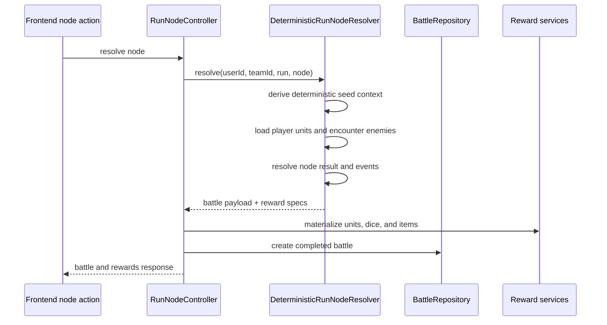
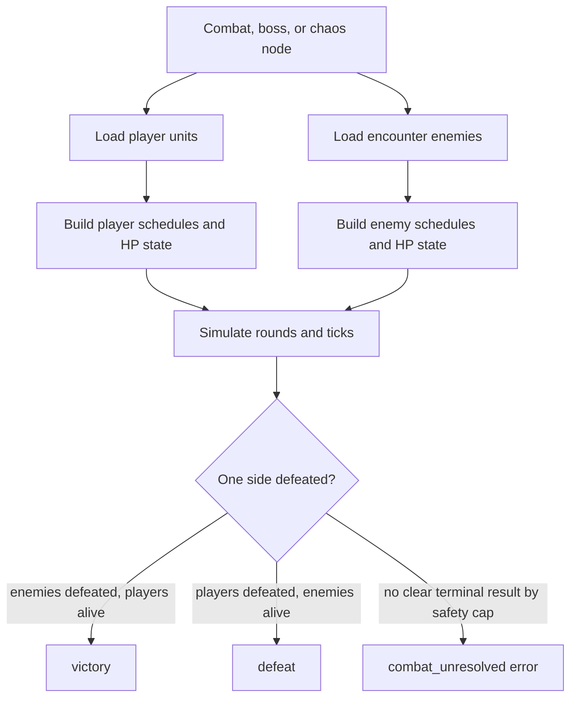
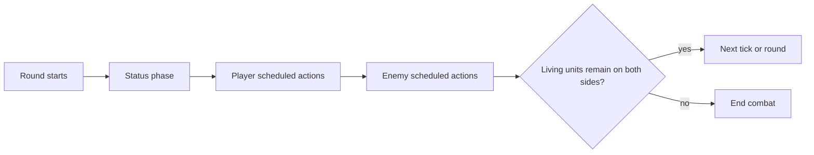

# Combat Resolution
----

Status: active
Last Updated: 2026-07-27
Owner: Engineering
Depends On: `backend/src/Combat/Engine/DeterministicRunNodeResolver.php`, `backend/src/Controllers/RunNodeController.php`, `backend/src/Services/RunLifecycleService.php`

## Purpose

Combat resolution turns a run node into a deterministic battle result, event log, reward payload, and claimable progression package.

## Resolution Flow



## Determinism

The resolver derives its seed context from user, run, run seed, node, team, and encounter template data. Result metadata includes `seed_key_version` `v2` and engine `deterministic_v1`.

The deterministic resolver still depends on current database state for loaded unit stats, equipped abilities, encounter templates, dice definitions, unlocked unit types, and enabled kin variants.

## Noncombat Nodes

The resolver handles these node types without round simulation.

| Node type | Outcome | Defaults |
| --- | --- | --- |
| `rest` | `victory` | `Full Recovery`, zero XP, zero ticks, zero rounds. |
| `loot` | `victory` | `Loot Cache`, `8` soft currency before reward rolls. |
| `hazard` | `victory` | `Hazard Avoided`, zero XP, zero currency. |
| `shrine` | `victory` | Generated quality-weighted shrine effect from the encounter catalogue; may grant teeth, heal, persist a run modifier, or clear an available combat node. |

## Combat Node Math

Combat outcome is determined by simulated combat events. The resolver no longer uses player-power versus enemy-power scoring as a fallback win/loss estimate.



`buildCombatEvents()` simulates rounds, ticks, actions, damage, statuses, and deaths. If that simulation ends with enemies dead and players alive, the outcome is `victory`. If it ends with players dead and enemies alive, the outcome is `defeat`.

The engine has an explicit safety cap of `200` rounds to prevent an infinite loop. Hitting that cap without a clear terminal state raises `combat_unresolved`; it does not award a fallback victory or defeat.

## Run Combat Modifiers

Before combat starts, active run-unit effects can modify combat stats for the next eligible fight. Shrine modifiers currently use this path.

- `stat_multipliers` can adjust `attack`, `defense`, `precision`, `resolve`, or combat `damage`.
- `stat_adders` can adjust `attack`, `defense`, `precision`, or `resolve`.
- Applied modifiers are included in participant metadata under `run_combat_modifiers`.
- Damage modifiers are listed in action `affix_outcome` text as `run modifier damage xN`.
- After a new combat-like node is resolved, next-combat modifiers are decremented or removed from `run_unit_state.status_effects_json` and logged under `run_combat_modifiers_consumed`.

## Round and Action Timing

- Each round has `20` ticks.
- Combat continues until one side is defeated, or until the explicit unresolved-combat safety cap is reached.
- Active abilities are scheduled in equip order by cumulative speed.
- Combatants must have at least one explicit schedulable active ability.
- Unused ticks remain empty; the scheduler does not auto-repeat filler actions.



## Dice Rolls

Each ability rolls its provided dice pool. Empty pools contribute `0`. For each die slot, the full roll total contributes to the action:

```text
roll_total
```

Dice with the `explode_once` affix roll one extra die when the first roll equals the die's side count.

## XP and Currency Rewards

XP is based on enemy `xp_reward` totals. If enemy XP totals are empty or zero, the fallback is `10 * difficulty_rating`.

| Outcome | XP | Soft currency |
| --- | --- | --- |
| Victory | Full computed XP | `(5 * difficulty_rating) + 0-5` |
| Defeat | `floor(full XP * 0.25)` | `0` |

XP and currency are applied when the battle is claimed, not merely when the node is resolved.
