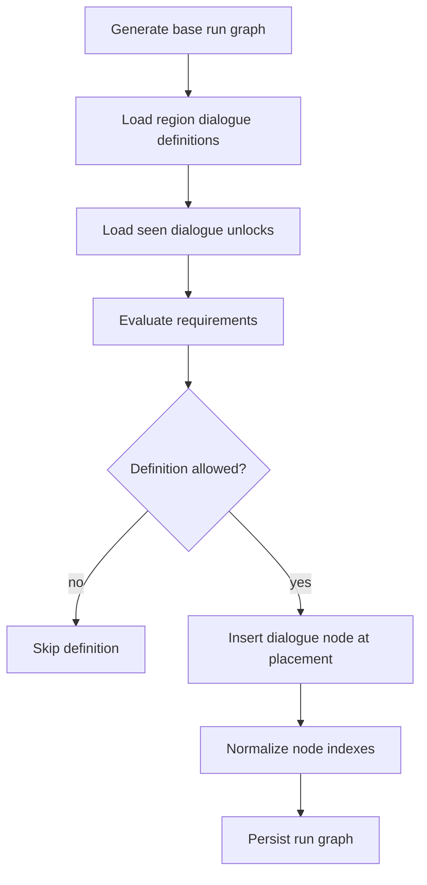
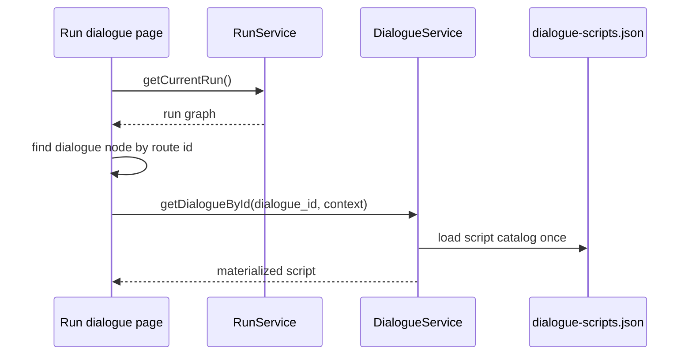
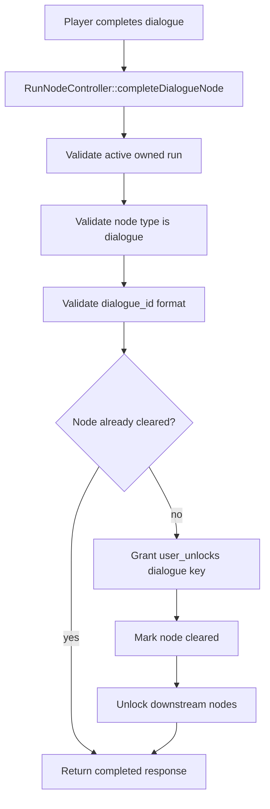

# Dialogue Flow Determination
----

Status: active
Last Updated: 2026-07-27
Owner: Engineering
Depends On: `backend/src/Services/RunGraphGenerator.php`, `backend/src/Controllers/RunNodeController.php`, `frontend/src/app/pages/run-dialogue-page.component.ts`, `frontend/src/app/core/dialogue.service.ts`, `frontend/public/assets/data/dialogue/dialogue-scripts.json`

## Purpose

Dialogue flow determines which dialogue nodes are inserted into a run, which script is displayed, and how completion is recorded.

## Run Graph Insertion

Dialogue definitions live in `RunGraphGenerator`. A definition can require a previous dialogue unlock, require a feature unlock, exclude a feature unlock, be one-time, and target a placement such as `start`, `before_boss`, or `before_exit`.

## Implemented Dialogue Definitions

| Region | Dialogue id | Placement | Notable gates |
| --- | --- | --- | --- |
| `mystic_cave` | `start-run-kickoff` | `start` | One-time lore. |
| `mystic_cave` | `mystic-cave-wrong-machine-reminder` | `start` | Requires `start-run-kickoff`; excludes Wrong Machine. |
| `mystic_cave` | `mystic-cave-wrong-machine-recovered` | `start` | Requires `start-run-kickoff` and Wrong Machine. |
| `the_farm` | `farm-boss-intro` | `before_boss` | Can swap to the shop-unlocked variant. |
| `the_farm` | `farm-shop-unlock` | `before_exit` | One-time lore. |
| `mountains` | `archivist-first-contact` | `start` | One-time lore. |
| `mountains` | `wrong-machine-search-repeat` | `start` | Requires archivist contact; excludes Wrong Machine. |
| `mountains` | `kobold-machine-trail` | `before_boss` | One-time lore; excludes Wrong Machine. |
| `mountains` | `kobold-machine-recovered` | `before_boss` | Requires Wrong Machine. |
| `mountains` | `swamps-lead` | `before_exit` | One-time lore. |

## Frontend Script Selection

Run dialogue nodes carry `meta.dialogue_id`. The run dialogue page loads the active run, finds the route node, verifies that it is an unlocked dialogue node, and asks `DialogueService` for that exact script id.

## Materialization Defaults

`DialogueService` fills missing presentation data before the component renders the script.

| Field | Default |
| --- | --- |
| Title | Humanized script id. |
| Summary | `Recovered dialogue from your journey.` |
| Background URL | `null` |
| Player speaker name | Context player name, then `Player`. |
| Speaker side | Player party/role on left, enemy party on right, otherwise explicit side. |
| Player portrait | Context player portrait URL. |
| Start step | Explicit `start_step_id`, then first step id, then empty string. |
| Player reveal initial delay | At least `200`; default `700`. |
| Player reveal flash count | At least `1`; default `2`. |
| Player reveal flash interval | At least `80`; default `180`. |
| Player reveal between delay | At least `0`; default `220`. |
| Player reveal final hold | At least `300`; default `2000`. |

## Completion

Seen dialogue is stored as a `user_unlocks` entry in the `dialogue` namespace. This makes one-time and requirement-gated dialogue deterministic across future run generation.
