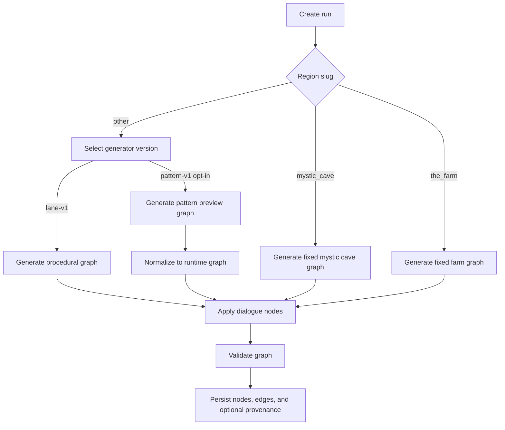
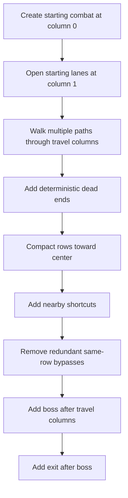
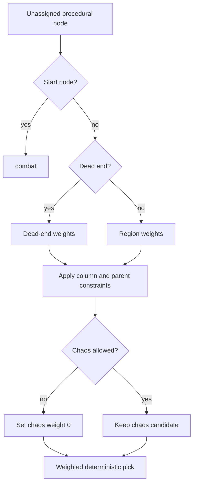
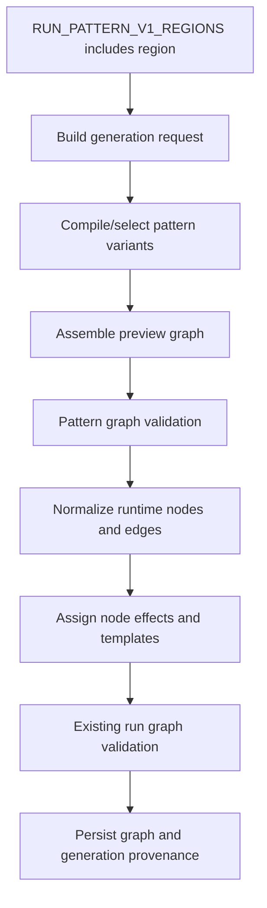

# Run Node Generation
----

Status: active
Last Updated: 2026-07-28
Owner: Engineering
Depends On: `backend/src/Services/RunGraphGenerator.php`, `backend/src/Repositories/RunRepository.php`

## Purpose

Run node generation builds the graph a player traverses during a run, including node types, edges, encounter templates, dialogue inserts, and availability state.

## Top-Level Flow

## Fixed Regions

| Region | Nodes | Shape |
| --- | --- | --- |
| `mystic_cave` | Dialogue start, exit | Linear `0 -> 1`; dialogue is available, exit starts locked. |
| `the_farm` | Combat, loot, rest, boss, exit | Linear `0 -> 1 -> 2 -> 3 -> 4`; first combat starts available. |

The farm uses fixed encounter templates for its combat, loot, rest, and boss nodes.

## Procedural Region Defaults

The default generator version is `lane-v1`. API run creation uses `RunGeneratorVersionSelector`, which only returns `pattern-v1` for regions listed in `RUN_PATTERN_V1_REGIONS`. With the default empty value, Mountains and Swamps still use `lane-v1`.

| Region | Rows | Travel columns | Paths | Opening rows | Lane gap | Dead ends | Dead-end chain | Rest weight | Loot weight | Combat weight |
| --- | ---: | ---: | ---: | ---: | ---: | --- | ---: | ---: | ---: | ---: |
| `mountains` | `9` | `8` | `3` | `3` | `2` | `2-3` | `1` | `1` | `2` | `5` |
| `swamps` | `11` | `10` | `4` | `4` | `2` | `3-5` | `1` | `2` | `3` | `3` |
| default | `9` | `9` | `3` | `3` | `2` | `2-4` | `1` | `2` | `2` | `4` |

Procedural generation uses a seed key made from region slug, region id, and run seed.

## Procedural Shape

Every node in the final travel column links to the boss, and the boss links to the exit.

## Procedural Node Type Assignment

The available start node is always set to `combat`. Boss and exit nodes keep their explicit types. Other nodes are assigned by weighted deterministic rolls.

| Situation | Weight behavior |
| --- | --- |
| Dead end | `loot: 50`, `rest: 30`, `combat: 20`, `shrine: 1`, `chaos: 1` |
| Normal path | Uses region `combat`, `loot`, and `rest` weights, plus `shrine: 1` and `chaos: 1`. |
| Column `<= 2` | Adds combat weight, removes rest, shrine, and chaos. |
| Near final travel column | Adds rest, shrine, and chaos weight. |
| Parent is rest | Removes rest from this node. |
| Parent is shrine | Removes shrine from this node. |
| Parent is chaos | Removes chaos from this node. |
| Chaos disallowed | Removes chaos from all rolls. |

After assignment, the generator guarantees at least one rest node when a candidate exists. If chaos nodes are allowed, it also guarantees at least one chaos node when a candidate exists.

## Dialogue Inserts

After the base graph is generated, `applyDialogueNodes()` can insert dialogue nodes for the region. Inserted dialogue nodes use metadata such as `dialogue_id`, `one_time`, and `tags`. Seen one-time dialogue can be removed from future graphs while preserving connectivity.

See `04-dialogue-flow-determination.md` for dialogue gating details.

## Pattern-V1 Boundary

`pattern-v1` is present as an explicit runtime path but is not the default for any region unless `RUN_PATTERN_V1_REGIONS` opts that region in. The pattern path currently:

- loads synced pattern profiles, region rules, definitions, and compiled variants;
- builds a deterministic generation request with catalog hash and profile version;
- assembles a preview graph from start, spine, and terminal patterns;
- validates the preview graph for reachability, boss gating, overlaps, edge endpoints, and unresolved visible sockets;
- normalizes the preview graph into existing `run_nodes` and `run_edges` shape;
- assigns hazard metadata, loot/shrine quality tiers, encounter templates, and final run graph validation;
- returns bounded generation metadata for `region_runs` provenance when persisted by `RunRepository::createRunGraph()`.

Remaining rollout work is still tracked in the Pattern-Based Run Map Generation milestone: richer branch/cap assembly, Mountains and Swamps opt-in evidence, story placement requests, and committed simulation quality gates.
