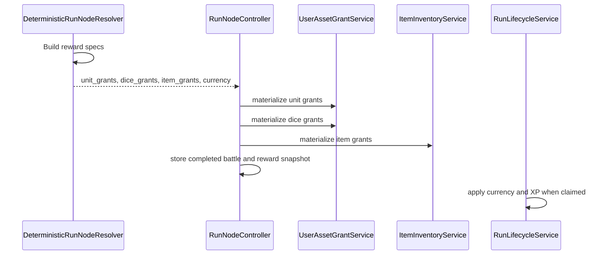
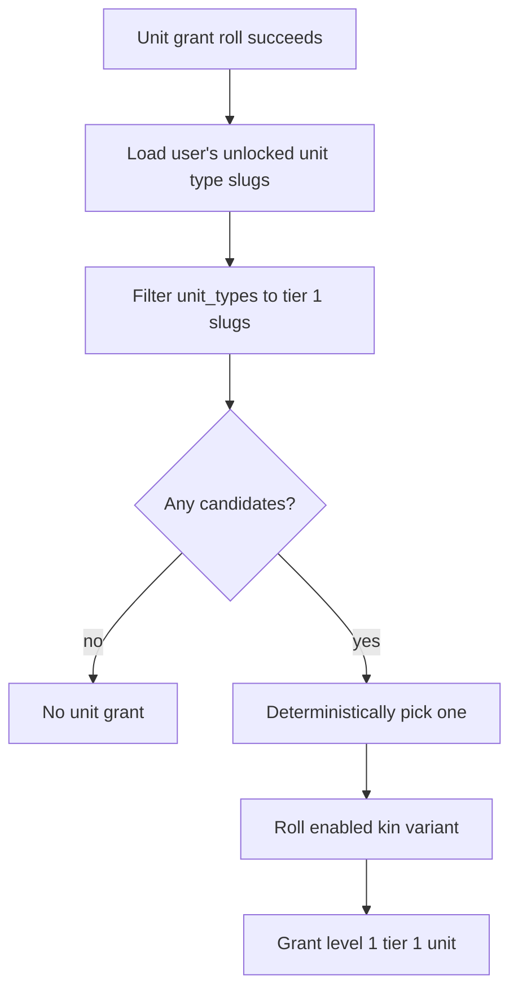
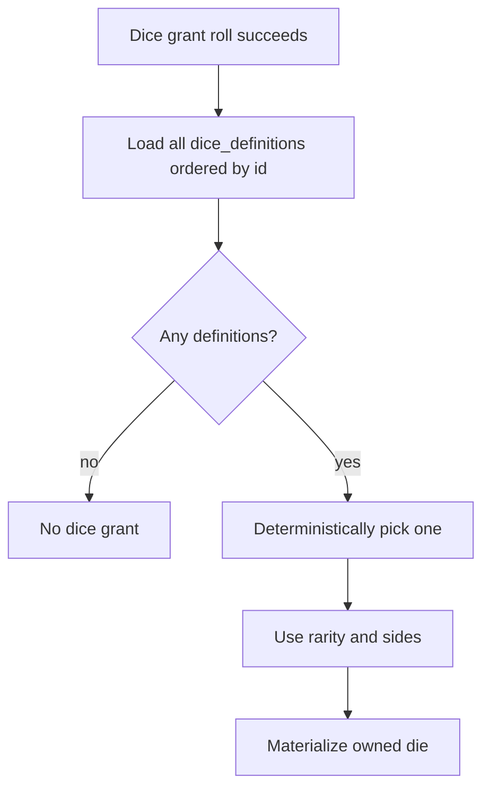

# Loot Determination
----

Status: active
Last Updated: 2026-07-27
Owner: Engineering
Depends On: `backend/src/Combat/Engine/DeterministicRunNodeResolver.php`, `backend/src/Controllers/RunNodeController.php`, `backend/src/Services/UserAssetGrantService.php`, `backend/src/Services/ItemInventoryService.php`, `backend/src/Services/RunLifecycleService.php`

## Purpose

Loot determination describes how node rewards are selected, materialized into user-owned assets, and surfaced for claiming.

## Reward Flow

Units, dice, and items are materialized when the node is resolved. Currency and XP are applied when the completed battle is claimed.

## Node Reward Defaults

| Node type | Reward behavior |
| --- | --- |
| `loot` | Starts with `8` soft currency and rolls for units/dice. If neither roll succeeds, a dice grant is guaranteed. |
| `combat` | Rolls for units/dice only on victory; can grant progression items from defeated enemies. |
| `boss` | Rolls for units/dice only on victory; can grant progression items from defeated enemies. |
| `chaos` | Uses combat resolution and battle claim behavior, but current reward rolls are not in the combat/boss/loot grant set. |
| `rest` | No loot grant payload. |
| `hazard` | No loot grant payload. |
| `shrine` | No unit/dice/item grants in the normal loot payload; resolves a generated shrine effect that can grant teeth, heal run units, persist run-state metadata, double earlier run teeth, or clear an available combat node. |

## Unit and Dice Grant Chances

| Node type | Unit grant chance | Dice grant chance | Guarantee |
| --- | ---: | ---: | --- |
| `loot` | `55%` | `80%` | At least one die if no unit or die rolled. |
| `combat` victory | `20%` | `35%` | None. |
| `boss` victory | `20%` | `35%` | None. |

The resolver uses deterministic `nextInt(100)` rolls for each chance.

## Unit Grant Selection

Unit grants only select from unit types already unlocked for the user in the `unit_type` unlock namespace. If no tier-one unlocked candidate exists, the grant is skipped.

## Dice Grant Selection

Dice grant defaults:

| Field | Default |
| --- | --- |
| `rarity` | `common` if missing. |
| `sides` | At least `2`; missing sides default to `6`. |

## Progression Item Grants

Progression items are granted only for victories on `combat` and `boss` nodes.

| Enemy condition | Item grant |
| --- | --- |
| Any enemy slug contains `pig` or `boar`, or equals `mudking` | `pig_ear`, quantity `1` on combat and `2` on boss. |
| Boss node includes enemy slug `mudking` | `mudking_crown_fragment`, quantity `1`. |

Enemy slugs are read from `template_slug`, then `slug`, then `id`.

## Materialization Rules

| Grant type | Materialization behavior |
| --- | --- |
| Unit | Malformed grants are ignored. Slug must be unlocked for the user. Tier is clamped to `1-3`; level is at least `1`; XP starts at `0`; generated display name is used. Runtime grant exceptions are skipped. |
| Dice | Malformed grants are ignored. Rarity defaults to `common`; sides are at least `2`. Runtime grant exceptions are skipped. |
| Item | Slug is required and quantity is at least `1`. Items are granted as inventory stacks. Runtime grant exceptions are skipped. |

## Raw Chaos Gate

`RunLifecycleService` zeroes raw chaos rewards unless the user has the Wrong Machine feature unlock. This gate is applied at battle claim time.
