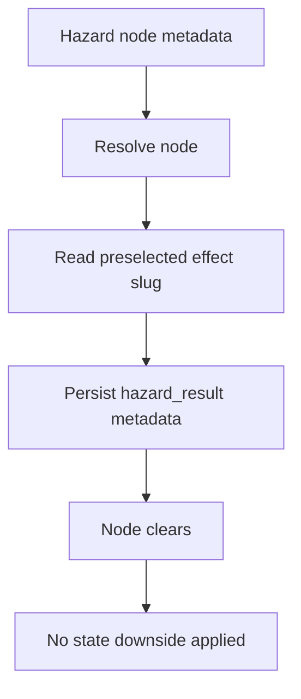
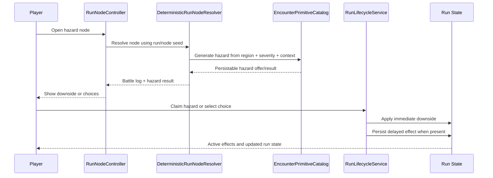
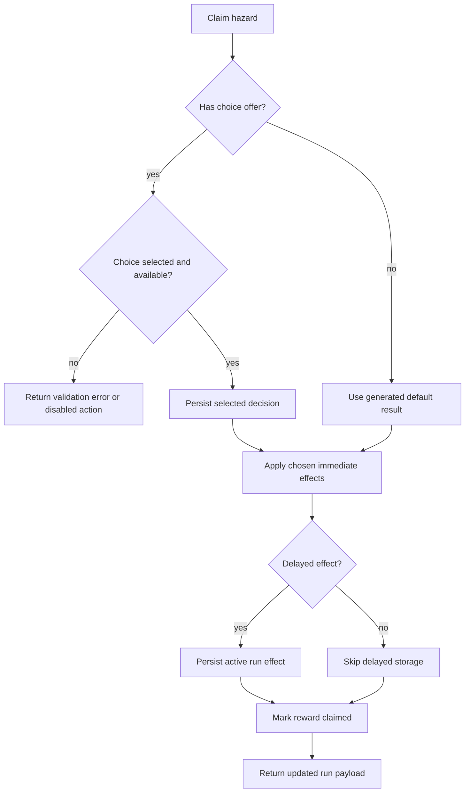

# Hazard Severity And Downsides
----

Status: planned
Last Updated: 2026-07-29
Owner: Systems Design + Engineering
Depends On: `backend/src/Services/EncounterPrimitiveCatalog.php`, `backend/src/Combat/Engine/DeterministicRunNodeResolver.php`, `backend/src/Services/RunLifecycleService.php`, `documentation/02-systems-mvp/03-encounter-scope.md`

## Purpose

This document defines the planned hazard expansion pass. Hazards should move from metadata-only route copy into generated downside encounters that behave like shrine offers in reverse: the map node supplies region and severity context, while the exact hazard effect is selected, persisted, surfaced, and applied when the player encounters the node.

## Current Gap

The live hazard catalog already has more than ten authored slugs and a primitive vocabulary, but most entries only produce result metadata. They clear the node, show generic hazard result copy, and do not yet apply HP loss, teeth loss, item pressure, delayed combat penalties, or explicit player choices.

## Target Model

Hazard nodes should use severity-weighted generated outcomes. The exact effect should not be preprogrammed into node metadata. Node metadata may keep map-display context, region, depth, and quality/severity hints, but the effect itself is generated when the node is encountered and persisted for idempotency.

Player-facing severity names:

| Severity | Expected pressure | Existing art compatibility |
| --- | --- | --- |
| `minor` | Small downside, teaching pressure, cheap choices. | Can map from `poor`. |
| `moderate` | Meaningful attrition or a real tradeoff. | Can map from `good`. |
| `severe` | High-pressure optional route risk or late-run consequence. | Can map from `great`. |

If implementation can add an explicit hazard field without unnecessary schema churn, prefer `hazard_severity_tier`. If the current node-quality contract is enough, map `poor`, `good`, and `great` to the player-facing severities above and keep the generated effect out of metadata.

## Resolution Flow

Retry rule: after a hazard result or decision is persisted, refreshes and repeated claim calls must return the same result instead of rerolling or reapplying the downside.

## Initial Hazard Options

The initial implementation should ship with at least ten enabled generated outcomes. Existing hazard slugs can be reused where they still fit, but each option needs concrete effect data instead of only pressure labels.

| Slug | Primitive | Regions | Severity pool | Outcome shape |
| --- | --- | --- | --- | --- |
| `hazard_cautious_footing` | `route_pressure` | All combat regions | minor, moderate | Small route/navigation pressure; safe baseline fallback. |
| `hazard_mud_slick` | `next_combat_stat_modifier` | Farm, Swamps | minor, moderate | Reduce squad precision next combat. |
| `hazard_broken_fence` | `hp_attrition` | Farm | minor, moderate | Damage one random unit or the front-most living unit. |
| `hazard_loose_scree` | `hp_attrition` | Mountains | moderate, severe | Damage multiple random units. |
| `hazard_thin_air` | `next_combat_stat_modifier` | Mountains | moderate, severe | Reduce defense or resolve next combat. |
| `hazard_toll_cairn` | `choice_cost` | Mountains | minor, moderate, severe | Choose between paying teeth or taking HP damage. |
| `hazard_rust_thicket` | `item_pressure` | Mountains, Swamps | moderate, severe | Lose or damage one eligible consumable, with HP fallback if no item exists. |
| `hazard_bog_mire` | `kin_mitigation` | Swamps | minor, moderate, severe | Pig Kin reduces or avoids the downside; otherwise HP or defense pressure applies. |
| `hazard_biting_reeds` | `hp_attrition` | Swamps | minor, moderate | Damage one unit now and expose result copy. |
| `hazard_sinking_cache` | `choice_cost` | Swamps | moderate, severe | Choose to abandon the cache safely or take damage for a small reward/route benefit. |
| `hazard_wrong_turn` | `route_pressure` | Mountains, Swamps | severe | Clear, lock, or reroute a non-critical available branch without breaking boss reachability. |

## Primitive Vocabulary

Target hazard primitives:

| Primitive | Use |
| --- | --- |
| `hp_attrition` | Apply bounded run-unit HP loss outside combat. |
| `currency_pressure` | Spend or lose teeth or Raw Chaos when the relevant unlock exists. |
| `item_pressure` | Remove, damage, or require consumables with a fallback if none exist. |
| `route_pressure` | Affect optional route visibility or availability without blocking guaranteed completion. |
| `next_combat_stat_modifier` | Apply one-fight attack, defense, precision, resolve, or damage modifiers. |
| `choice_cost` | Present two or more explicit costs and apply the selected one. |
| `kin_mitigation` | Reduce, avoid, or change a downside based on owned lineage context. |

Delayed modifiers should reuse the generic next-combat stat modifier machinery built for shrine favors where possible. The hazard pass must support defense and other stats, not only damage.

## Claim Application

Immediate effects should apply at claim time, not when the map is generated. Delayed effects should be visible in the active run effects panel until consumed by the next eligible combat.

## Implementation Order

1. Define generated severity catalog and tests.
2. Add hazard result/offer persistence and frontend choice rendering.
3. Apply immediate downsides and delayed next-combat modifiers.
4. Add sampler commands and baseline evidence.
5. UAT/tune severity weights across Farm, Mountains, and Swamps.

## Validation Notes

- Hazards should still grant no combat XP by default.
- Hazard choices need insufficient-cost handling before the player commits.
- Route-pressure effects must never make the boss or exit unreachable.
- Raw Chaos costs should respect the Wrong Machine unlock gate.
- Samplers should report pressure in player-facing units: HP lost, teeth spent/lost, items affected, delayed effects, and choice frequency.
